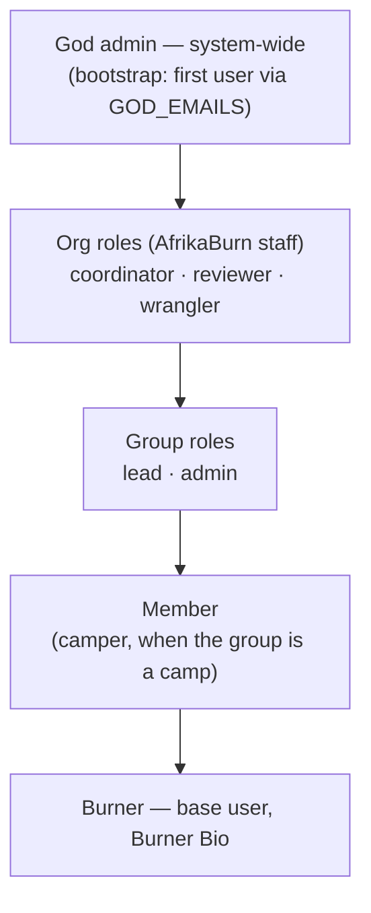
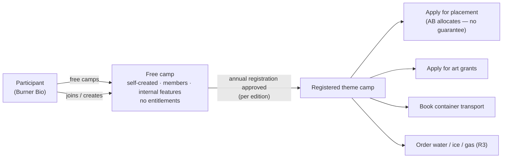
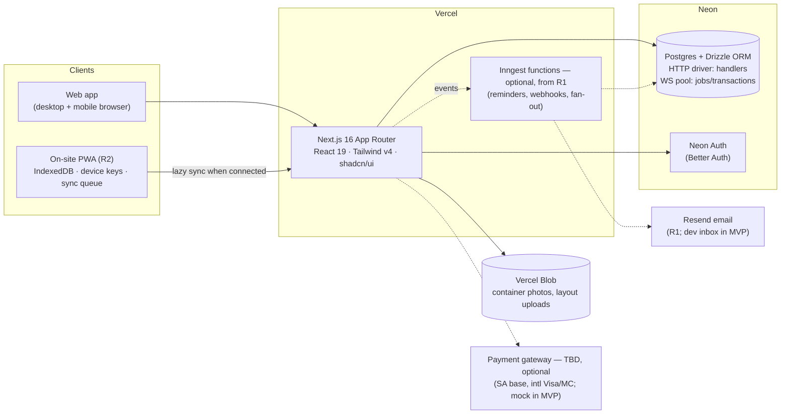
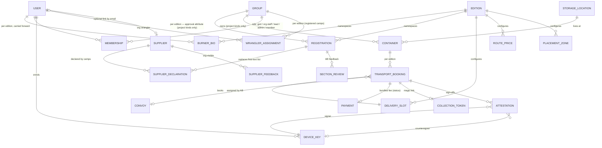
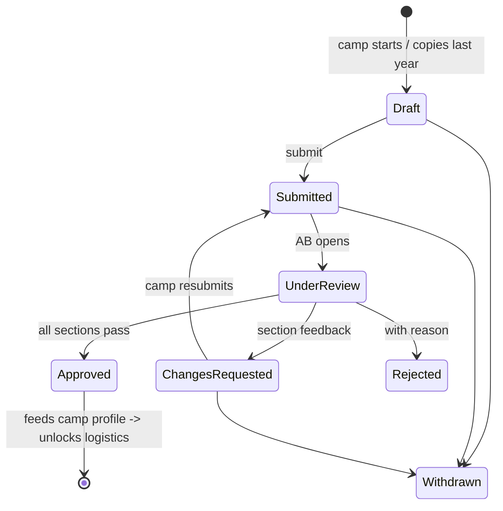
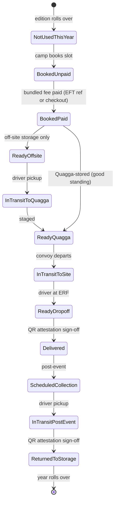
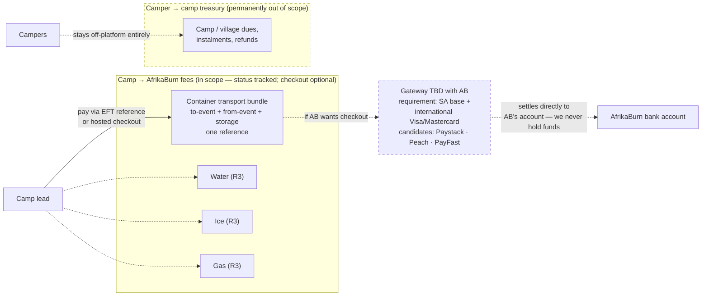
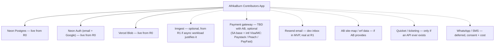
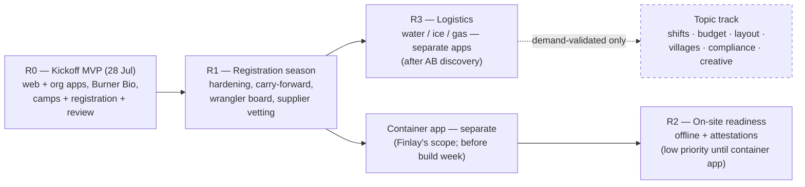

# AfrikaBurn Contributors App

_Working name candidate: **Quagga Portal**_

A unified platform for AfrikaBurn theme camps — annual registration, container
transport, and on-site services (water / ice / gas) — serving camps, AfrikaBurn staff,
and contractors. It replaces a patchwork of Google Forms, Quicket payments, WhatsApp
threads, and last year's standalone container app.

**Status:** MVP built and CI-green — `apps/web` (participant app: Burner Bio onboarding,
camp directory/creation/invites, six-section registration wizard) and `apps/org`
(organiser console: review workflow, account elevation, suppliers, payment
reconciliation) — awaiting first deployment (see [`docs/deploy.md`](docs/deploy.md)).
Kickoff demo: 28 July 2026.

## Development

```bash
pnpm install
pnpm turbo run lint typecheck test build   # the full CI gate
pnpm --filter @quagga/web dev              # participant app :3000
pnpm --filter @quagga/org dev              # organiser console :3001
```

Both apps boot without any environment variables (graceful "not configured" state).
`cp .env.example .env` and fill in what you have. Database changes: edit
`packages/db/src/schema.ts` → `pnpm --filter @quagga/db db:generate` (never hand-edit
migrations; never wire migrations into a build script — they are applied manually via
`db:migrate` once a database exists).

**Core product principle — fewer forms, not more.** The problem being solved is that
people don't fill out forms. Every feature must reduce net administrative burden:
derive over ask, carry forward by default, aggregates over rosters, progressive
disclosure. A feature that adds mandatory admin has the burden of proof against it.

**Core technical constraint — zero on-site connectivity.** There is no signal at the
AfrikaBurn site. Anything that happens on site works from pre-synced local data, and
proof-of-interaction uses an offline two-party QR signature handshake ("attestations")
with lazy sync afterwards.

**Money stance — the platform never holds funds.** No camp fees, no camp treasuries.
The only money in scope is AfrikaBurn-side logistics fees, tracked as payment _status_
first; integrated checkout happens only if AB wants it, via an SA-based gateway that
accepts international Visa/Mastercard.

## Documents

| Doc                                                              | What it holds                                                                                                                                                                                                          |
| ---------------------------------------------------------------- | ---------------------------------------------------------------------------------------------------------------------------------------------------------------------------------------------------------------------- |
| [`docs/synthesis.md`](docs/synthesis.md)                         | Correlated requirements from all sources: buildable scope vs ideation topics, users, domain model, tensions, open questions                                                                                            |
| [`docs/mvp-proposal.md`](docs/mvp-proposal.md)                   | Kickoff MVP: demo script, scope, offline/attestation architecture, stack, data model, build plan                                                                                                                       |
| [`docs/roadmap.md`](docs/roadmap.md)                             | Committed releases R0–R3 + candidate topic track                                                                                                                                                                       |
| [`docs/sources/`](docs/sources/)                                 | Extracted text of every source document (originals at repo root)                                                                                                                                                       |
| [`docs/sources/quaggapedia/`](docs/sources/quaggapedia/INDEX.md) | Full mirror of Quaggapedia (AB's official event wiki): 68 pages + 21 files — supplier depot rules, SOOP sound levels, WAP/ticket rules, DMV process, LNT/fire/generator rules, event & sound maps, STAR onboarding PDF |

Sources: Finlay Kettlewell's Master Brief + five scope docs + discovery agenda (the
**concrete scope**), and Graham's Quagga Portal platform doc (**ideation topics only**).

---

## Module map

Committed modules come from Finlay's scoped documents; the topic track holds Graham's
ideation themes, which only graduate with validated demand and a pass on the
fewer-forms test.

```mermaid
flowchart TB
    subgraph SPINE["Shared spine (R0)"]
        AUTH["Auth: email + Google OAuth<br/>magic-link tokens for handover roles"]
        BIO["Participant onboarding<br/>Burner Bio (per-edition, privacy-flagged)"]
        QUEST["Questionnaire engine<br/>(ported from Camp 404)"]
        PROJ["Groups (org · camps · art · MV) + Editions<br/>many-to-many memberships; self-registered;<br/>approval = attribute"]
        ATT["Attestation primitive<br/>(offline QR sign-off)"]
        NOTIF["Notifications<br/>(dev inbox → email at R1)"]
    end

    subgraph V1["V1 — committed, detailed scope (R0–R1)"]
        REG["Theme Camp Registration<br/>6-section wizard + AB review"]
        CON["Container Transport — SEPARATE APP<br/>(large camps only; Finlay's scope = its spec)<br/>hint tile in the standard app"]
        SUPP["Supplier repository (R1)<br/>register · vet · declare · feedback<br/>(deep portal = separate sub-project)"]
    end

    subgraph V2["V2 — committed, needs AB input (R3)"]
        WATER["Water delivery"]
        ICE["Ice allocations"]
        GAS["Gas orders"]
    end

    subgraph TOPICS["Topic track — ideation only, not committed"]
        SHIFTS["Shifts"]
        BUDGET["Working budget"]
        PEOPLE["Camper tools"]
        LAYOUT["Layout designer"]
        VILLAGE["Villages"]
        COMPLY["Compliance review"]
        CREATIVE["Creative projects (artworks / MVs)"]
    end

    SPINE --> V1
    V1 --> V2
    V2 -.->|"only via demand + fewer-forms test"| TOPICS

    style TOPICS stroke-dasharray: 5 5
```



**Registration is upstream of everything** — it creates the camp profile (ERF, contacts,
size) that containers, water, ice, and gas all read from. A camp cannot book transport
until registered.

### Burners, groups & entitlements

| Term           | Meaning                                                                                                                                                                                                                                            |
| -------------- | -------------------------------------------------------------------------------------------------------------------------------------------------------------------------------------------------------------------------------------------------- |
| **Burner**     | Any user — every account onboards a Burner Bio                                                                                                                                                                                                     |
| **Camper**     | A burner who is a member of a camp                                                                                                                                                                                                                 |
| **Group**      | Anything joinable: the org, theme camps, art projects, mutant vehicle teams. Multi-membership allowed (camp + art project + MV team)                                                                                                               |
| **Project**    | Any non-org group — the kind that registers and earns entitlements                                                                                                                                                                                 |
| **Org**        | The AfrikaBurn organisation as a group; staff roles are org memberships                                                                                                                                                                            |
| **God admin**  | System-wide maximum privileges; the first user bootstraps into it                                                                                                                                                                                  |
| **Supplier**   | Camp-hired service provider (tent builds, electricity). Registers via a dedicated URL/procedure — not burner sign-up — optionally linked to a burner account by email. Camps declare suppliers from the repository; org vets and collects feedback |
| **Contractor** | Works for AB fulfilling logistics (truck/water drivers) — token access, not accounts                                                                                                                                                               |



Camps are **self-registered by burners** — never pre-created by AB — and work
immediately as free camps. Completing the annual registration flips a per-edition
**approval attribute** that unlocks entitlements; it never guarantees allocation.

Registered groups (all kinds) are **public and indexable** in a group directory, badged
_accepting new members_ or _invite-only_ (one-time invite links, Camp 404 pattern);
unregistered groups may stay private. Finer privacy settings are schema-reserved but
deliberately unbuilt until needed. **Wranglers** (org role) are assigned per edition to
registered camps and get a board tracking each camp's progress.



## System architecture (backend)



Monorepo: Turborepo + pnpm — **`apps/web`** (participants) + **`apps/org`** (admin/org,
separate deployment; account elevation, review, allocations), with future separate apps
for containers and water; `packages/{ui,db,types,...}` under the `@quagga/` namespace —
patterned on
[Camp 404](https://github.com/ryry79261/camp-404). CI gate:
`turbo run lint typecheck test build`.

## Data model



Decisions encoded: **editions (years) are the root namespace** — Burner Bios,
registrations, and bookings hang off the active edition, carried forward by
confirm-and-copy; **participants are the base user** (per-edition Burner Bio with
privacy-flagged fields; camp affiliation is just a membership); **approval is an
attribute, not existence** (self-registered projects work as free camps; the
registration record derives entitlements); the **Camp 404 questionnaire spine** runs
the Burner Bio and future gated flows; the joinable table is `groups`
(kind: org | theme_camp | artwork | mutant_vehicle) with many-to-many memberships, so
artworks/MVs and multi-membership come free; roles derive from memberships (god → org
staff → lead/admin → member), never from stored flags; sensitive columns
pgcrypto-encrypted (POPIA); attestations are append-only evidence from which status is
derived.

## State machines

### Registration (7 states)



### Container delivery lifecycle (12 states)



## Offline attestations (the no-signal answer)

```mermaid
sequenceDiagram
    participant D as Driver phone (offline)
    participant C as Collection person phone (offline)
    participant S as Server

    Note over D,C: On site — zero connectivity
    D->>D: Compose payload {type, booking, edition, nonce, keyId} + sign (device key)
    D->>C: Display QR
    C->>C: Scan; verify signature against pre-synced public key
    C->>C: Countersign; store locally (append-only)
    C-->>D: Optional receipt QR — both parties hold proof

    Note over C,S: Later — any connectivity (wifi box or back in town)
    C->>S: Lazy-sync queued attestations
    S->>S: Verify both signatures; idempotent, order-tolerant
    S->>S: Derive state: booking → Delivered
```

Device keypairs are generated on-device at login (WebCrypto ECDSA P-256,
non-extractable); public keys distribute in the pre-event "pack for site" sync bundle.
Offline timestamps are claims, not proofs — the signatures prove the interaction, nonces
prevent replay. The same primitive later covers ice redemption and gas handover.

## Payments

### Money flows — what's in scope



The platform **never holds funds**. Camp dues/treasuries are permanently out of scope
(no reason to be a payment intermediary for ~120 camp treasuries). Even AB-side fees
start as _status tracking_ — a booking gets a payment reference, AB reconciles, the
coordinator (or a webhook, if a gateway is ever integrated) marks it paid. Whether AB
wants in-app checkout at all is a discovery question; Finlay's docs assume Yoco, which
is domestically focused — the standing requirement if we integrate is an SA-based
provider accepting international Visa/Mastercard (whoever operates this will be in SA;
payers may not be).

### Payment gate — booking flow

```mermaid
sequenceDiagram
    participant L as Camp lead
    participant APP as Next.js app
    participant PP as PaymentProvider seam
    participant DB as Neon Postgres
    participant AB as AB coordinator

    L->>APP: Confirm booking (bundled price breakdown)
    APP->>DB: Create booking + payment (pending, with reference)
    alt EFT / existing AB channels (default)
        L->>AB: Pays via EFT / Quicket with reference
        AB->>APP: Mark reconciled → paid
    else Hosted checkout (only if AB opts in, R1+)
        APP->>PP: Create checkout session
        PP-->>L: Hosted checkout (gateway TBD; mock in MVP)
        PP->>APP: Webhook — payment completed
    end
    APP->>DB: BookedUnpaid → BookedPaid
    APP->>L: Confirmation (dev inbox in MVP, Resend at R1)
```

The `PaymentProvider` interface is the seam: the MVP ships a mock + the EFT-reference
flow; a real gateway adapter drops in later without touching the booking flow — and in
every variant, funds settle to AfrikaBurn's account, never ours.

## Integrations at a glance



## Roadmap at a glance



Deadlines drive the order: 2027 registration opening → R1; build week 2027 → R2.
Full detail in [`docs/roadmap.md`](docs/roadmap.md).

## Stack summary

| Layer          | Choice                                                                                                        |
| -------------- | ------------------------------------------------------------------------------------------------------------- |
| Monorepo       | Turborepo + pnpm, Node ≥ 22                                                                                   |
| Web            | Next.js 16 (App Router), React 19, Tailwind v4, shadcn/ui                                                     |
| DB             | Neon Postgres + Drizzle ORM                                                                                   |
| Auth           | Neon Auth (Better Auth): email + Google OAuth; magic-link/PIN tokens for handover roles                       |
| Async          | Route handlers in MVP; Inngest optional later if the workload justifies it                                    |
| Payments       | Payment details + reference + status blocks only — no processing, never holds funds ("we track, AB collects") |
| Offline crypto | WebCrypto ECDSA P-256 + QR (BarcodeDetector / jsQR) — client-side only                                        |
| Storage        | Vercel Blob                                                                                                   |
| Email          | Resend from day one (auth, magic links, notifications)                                                        |
| Hosting        | Vercel                                                                                                        |

## The Quaggapedia mirror — how it was built

`docs/sources/quaggapedia/` is a full snapshot (22 July 2026) of
[Quaggapedia](https://quaggapedia.afrikaburn.com), AfrikaBurn's official event wiki,
captured so this project's requirements rest on AB's own published ground truth. It is
a point-in-time mirror — the wiki will drift; re-run the process below to refresh.

**Method** (fully automated, reproducible):

1. **Enumeration** — the wiki's open MediaWiki API (`/api.php`, `list=allpages`) was queried across _every_ namespace, proving completeness rather than assuming it: 123 main-namespace pages (no continuation, zero redirects), ~1,500 Translate-extension fragments, 221 files, 10 trivial talk stubs. The site blocks default HTTP clients (403) — a browser User-Agent is required.
2. **Filtering** — language-variant duplicates (`/en-gb`, `/ru`, `/af`) and junk pages were excluded, leaving 68 canonical content pages.
3. **Fan-out capture** — a Claude Code agent workflow fetched raw wikitext for all 68 pages in parallel (9 Claude Sonnet agents, ~8 pages each), converted each to clean markdown with provenance frontmatter, and wrote them to the repo.
4. **Asset harvest** — the 21 informative binaries (event maps 2022–2026, sound maps, supplier rules, the STAR theme-camp onboarding PDF, WTF guide) were pulled via the API's `imageinfo` URLs; ~200 event photos were left behind.
5. **Mining** — a Claude Opus agent read the whole corpus against the project's open-question list and produced sourced, quoted answers (folded into [`docs/synthesis.md`](docs/synthesis.md)).

**Run metrics:**

| Metric                             | Value                                              |
| ---------------------------------- | -------------------------------------------------- |
| Pages mirrored / total on wiki     | 68 / 123 (55 translation variants + junk excluded) |
| Binary assets captured             | 21                                                 |
| Agents                             | 10 (9× Sonnet fetch, 1× Opus mining)               |
| Tool calls                         | 199                                                |
| Subagent tokens                    | 585,452                                            |
| Wall-clock time                    | 7 min 37 s                                         |
| Agent failures                     | 0                                                  |
| Open questions answered / narrowed | 7 fully, 3 partially (of 10)                       |

## Repo notes

- The canonical source-document content lives as text extractions in [`docs/sources/`](docs/sources/) (with one example contact redacted). The original PDFs are preserved verbatim on the **`archive/source-documents`** branch and are not tracked on `main`; the discovery-agenda docx remains at the root. `AfrikaBurn App/` is an untracked byte-identical duplicate folder.
- Before this repository is made public: delete or relocate the `archive/source-documents` branch and rewrite `main` history once (the pre-redaction extraction and the original PDFs exist in earlier commits).
- The collaborators' sign-on HTML prototype is referenced but **not yet in the repo**.
