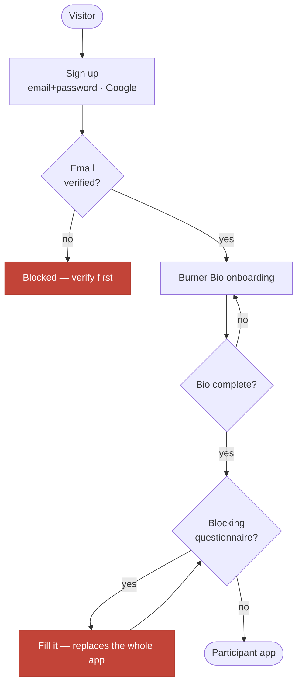
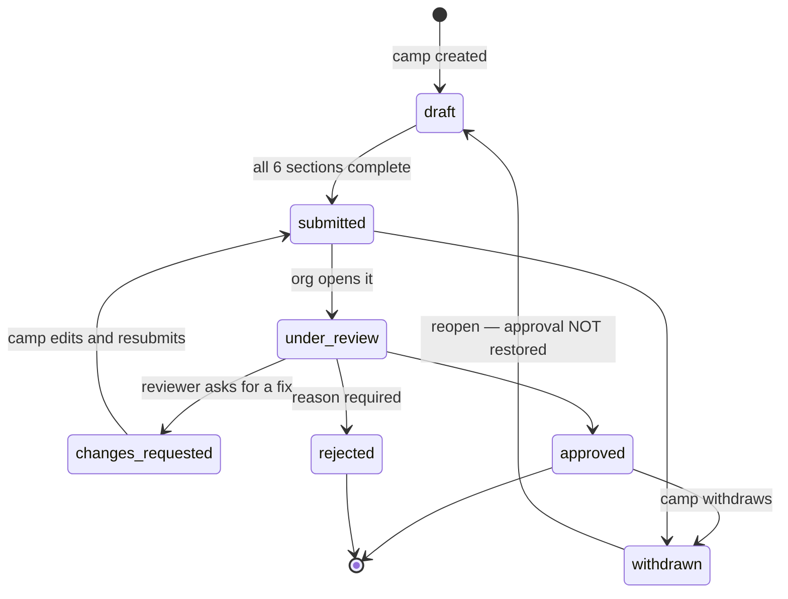
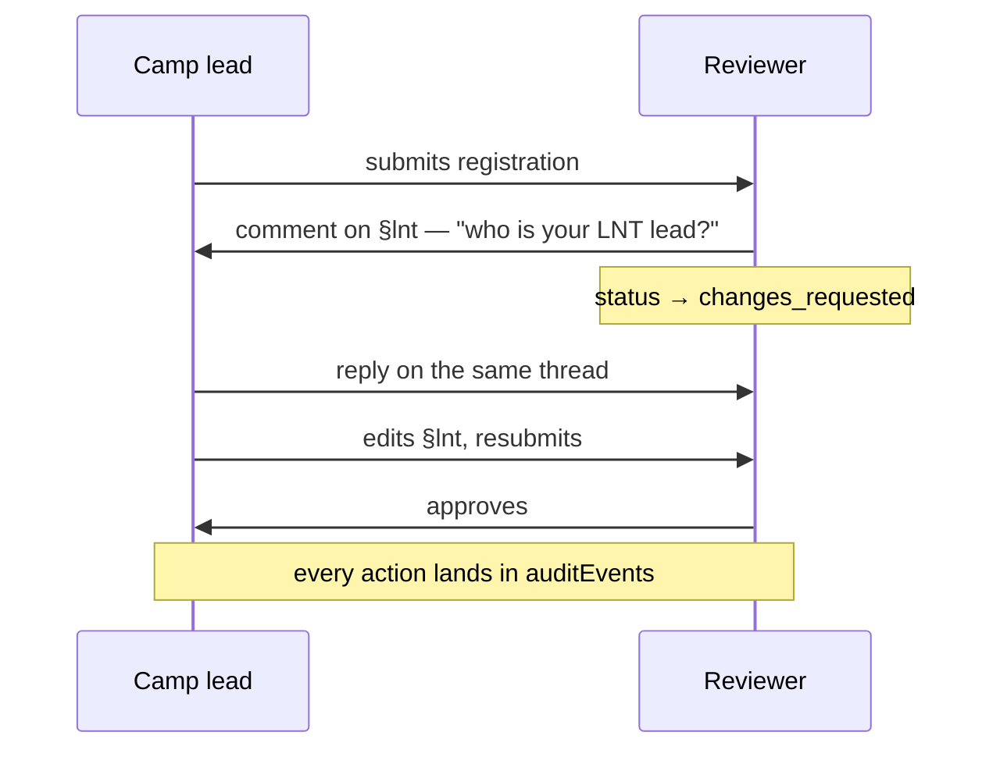
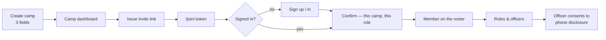
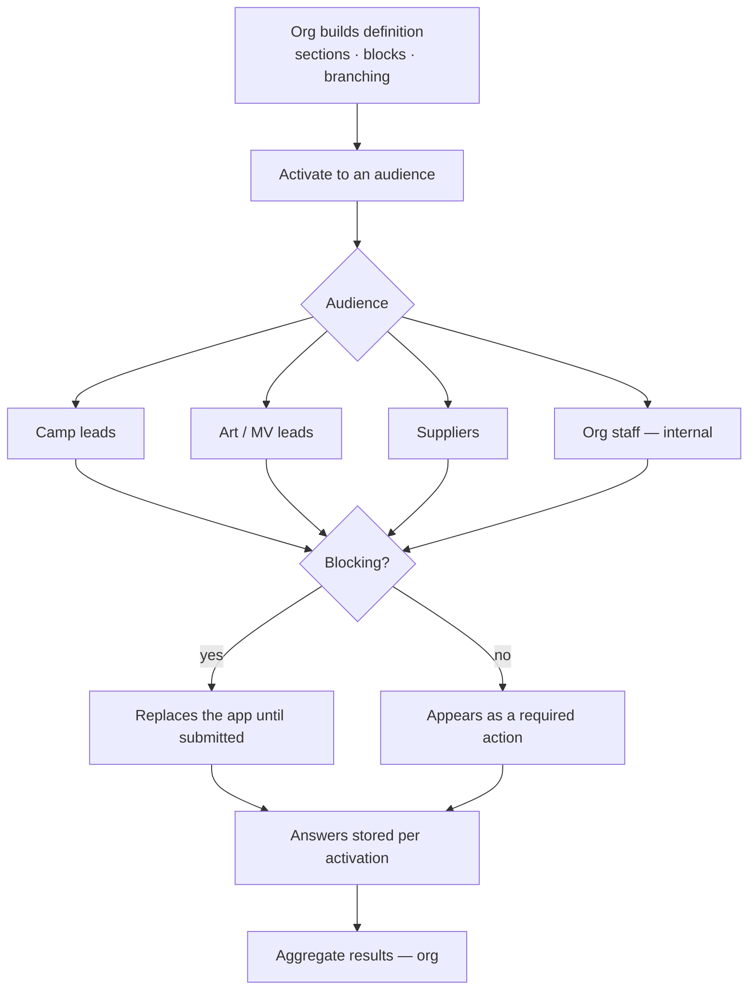
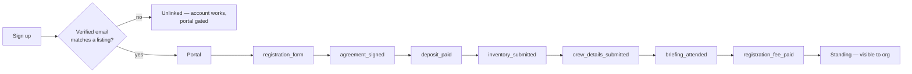
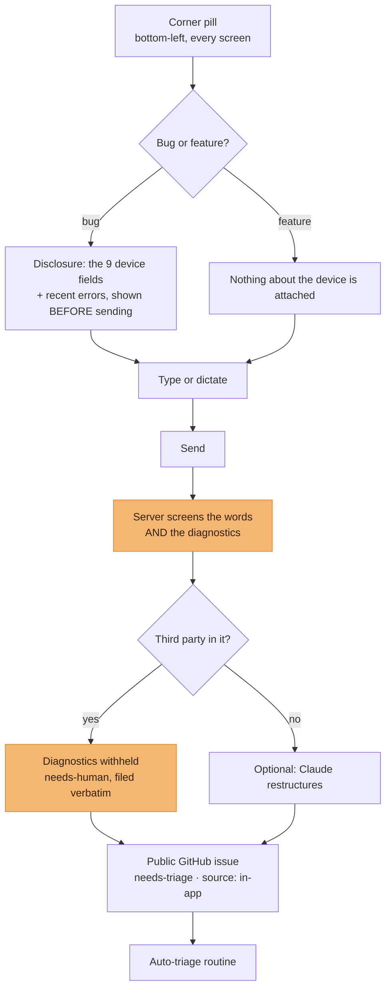
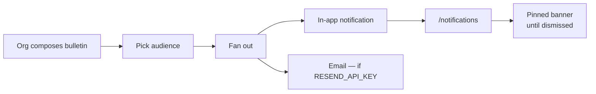

# User flows

The journeys the product exists for, as they actually behave. Each names the
code that enforces it, so a diagram that drifts can be caught against a file.

## Arriving: sign-up to a usable account

A blocking questionnaire replaces the app rather than nagging beside it —
`getBlockingActivation` in `@quagga/core`, applied in each app's route-group
layout. Account management stays reachable throughout: somebody stuck behind a
gate may still need to change a password or sign out a stolen session.

## The core loop: registration and review

Six sections, one state machine, two audiences. This is the journey the product
is for.

The sections are `identity`, `lnt`, `participation`, `size_logistics`,
`sound_placement`, `suppliers_commerce` (`SECTION_KEYS`, `@quagga/types`). A
section is complete when its predicate says so — `isSectionComplete`, not a
manual tick.

Two transitions carry rules worth stating:

- **Reopening a withdrawn registration returns a draft, never the approval.** An
  approval restored without re-review would hand back a placement nobody looked
  at.
- **Rejection requires a reason**, and it reaches the camp with the reason
  attached. A refusal a camp cannot act on is a support ticket in waiting.

The review conversation is per-section and two-way:

## Camps: creation to roster

Officer assignment is **consented, not imposed**: naming somebody as an officer
publishes a contact number to people outside their camp, so it asks first.

## Questionnaires

Audience resolution decides who is asked, and it is a privacy boundary as much
as a routing one: `questionnaire-authz.ts` in `@quagga/core`.

## Suppliers

Seven steps, in `SUPPLIER_ONBOARDING_STEPS`:

`unlinked` is an ordinary state, not an error. The account exists before the
listing does and outlives it, which is why account management sits outside the
portal gate.

## Reporting a bug

The reporter is only offered where it can work: no `GITHUB_TOKEN`, no pill.
What happens to the issue afterwards is [`triage.md`](triage.md).

## Notifications and bulletins

A bulletin reaches its audience and nobody else — the e2e suite asserts the
"nobody else" half, because that is the half that fails quietly.
