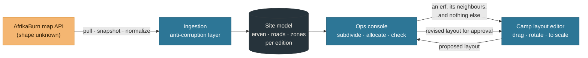

# GIS, map ingestion and placement — implementation plan

| Field                  | Value                                                                                  |
| ---------------------- | -------------------------------------------------------------------------------------- |
| **Category**           | Engineering Spec                                                                       |
| **Doc status**         | Draft — research and plan. Nothing here is built; nothing here is decided              |
| **Normative language** | RFC 2119 / RFC 8174 applies                                                            |
| **Requirement IDs**    | Partial — App Spec §11 `LAYOUT-*`, §12 `TENT-*`, §13 `ERF-*`. Cites them; defines none |
| **Owner / Updated**    | Repo maintainers, 2026-09-16                                                           |

## Why this document exists now

[Decision 011](decisions/decision-011-layout-tool-strategy.md) deferred the
layout tool and [Decision 012](decisions/decision-012-map-erf-readiness.md) gated
erf placement, both on the same two things AfrikaBurn owed us:

1. a **machine-readable map**, and
2. an **erf grammar** — what an erf identifier is, and whether it is stable
   year to year.

AB has now indicated it will supply layouts **through an API**. That is half the
gate, and it moves the second half too: if AB publishes erf identifiers, the erf
grammar is _whatever the API emits_, and our job is to mirror it rather than
invent one — which is exactly what `@quagga/core` `placement-codes.ts` has been
holding the door open for since R1.

**The API's shape is unknown.** This document is therefore mostly about how to
build against a contract nobody has read yet without that uncertainty leaking
into the database, the domain, or the UI. It is written to be _refined_: the
[Unknowns register](#unknowns-register) is the part that changes when AB answers,
and the [Questions for AfrikaBurn](#questions-for-afrikaburn) section is the list
to actually send them.

Neither Decision 011 nor Decision 012 is resolved by this document. Both stay
**Open** until AB's API is real enough to read.

## What is being asked for

Three tools, three audiences, one geometry:



| Audience          | Wants                                                                                                                                                | App Spec                     |
| ----------------- | ---------------------------------------------------------------------------------------------------------------------------------------------------- | ---------------------------- |
| **Placement ops** | See the city. Click a block, divide it. Allocate a slice to a camp, a crew, or infrastructure. Honour "we want to be near X". Spot what does not fit | §13 `ERF-001`–`ERF-018`      |
| **Theme camp**    | Get my slice. See who my neighbours are. Drag my Bedouin tent, kitchen, generator and private tents onto it, to scale                                | §11 `LAYOUT-*`, §12 `TENT-*` |
| **Both**          | Send a layout back and forth until it is agreed                                                                                                      | §13 `ERF-018`–`ERF-023`      |

## The governing principle

> **The source's data is never the domain model.**

Every line below follows from that. AB's payload lands in an immutable snapshot,
is translated by a versioned adapter into our own canonical site model, and
nothing downstream — no table, no core predicate, no React component — ever sees
an AB field name. When AB changes the shape (and they will, annually, mid-season,
without telling us), one adapter changes and the blast radius stops there.

The second-order rule that makes it real: **the ingestion layer MUST be
installable before the shape is known.** Phase 0 below ships a probe that reads
the API and _reports_ what it found. We write the adapter against that report,
not against a guess.

---

## Part A — Ingesting an API of unknown shape

### A.1 What the shape is likely to be

A town planner (Roger van Wyk) and a mapping outfit (Kshetra) are involved, which
narrows the field considerably. Realistic candidates, roughly in order:

| Shape                                | Tell                                                         | Cost to support                                                 |
| ------------------------------------ | ------------------------------------------------------------ | --------------------------------------------------------------- |
| **Esri ArcGIS FeatureServer**        | `.../FeatureServer/0/query?f=geojson`, `esriGeometryPolygon` | Low — it speaks GeoJSON if asked; paging via `resultOffset`     |
| **OGC API – Features / WFS**         | `/collections/{id}/items`, `GetFeature`                      | Low — GeoJSON is the default encoding                           |
| **A plain GeoJSON endpoint or file** | `FeatureCollection`                                          | Trivial                                                         |
| **Shapefile / GeoPackage export**    | A `.zip` with `.shp/.dbf/.prj`, or `.gpkg`                   | Medium — needs a parser, and the `.prj` is where the CRS is     |
| **CAD (DXF/DWG)**                    | Layers named like `ERF`, `ROAD`, `KRING`                     | High — CAD has no attributes, no CRS, and layer names as schema |
| **Bespoke JSON**                     | Anything else                                                | Low per-shape, but the shape moves                              |
| **A PDF, again**                     | It is April                                                  | Out of scope — this plan does not resurrect PDF tracing         |

The adapter registry MUST be able to carry more than one of these at once, and
each protocol MUST be its own adapter implementation behind a common interface —
`esri-featureserver@1`, `ogc-features@1`, `geojson@1` are three adapters, not one
with three URL templates. They differ in exactly the place that silently loses
data: **paging**. Esri pages on `resultOffset` plus an `exceededTransferLimit`
flag, OGC API – Features pages on a `next` link relation, and a static GeoJSON
document does not page at all. An adapter that assumes the wrong one stops early
and imports a city with half its erven, which looks like a successful import.
Authentication differs the same way (token query parameter, bearer header, none).

What stays configuration rather than code is the **field mapping** below.

### A.2 The probe ships before the adapter

`packages/geo/scripts/probe-map-source.ts` — a **read-only** CLI that takes a URL
and credentials, walks a representative sample of the collection, and writes a
report:

- transport: status, content type, paging style, auth style, rate limits seen
- encoding: GeoJSON / EsriJSON / GML / other; CRS as declared (`crs` member,
  `spatialReference.wkid`, a `.prj` string) **and** as inferred from the actual
  coordinate magnitudes, because the two disagree more often than not
- geometry: types present, ring winding, vertex counts, bounding box
- attributes: every key seen, its inferred type, cardinality, and three
  example values — this is what becomes the field-mapping config
- candidate identifiers: which attributes are unique across the sample, which
  look stable, which look like an erf label

**A single page is provisional and MUST NOT be promoted to the field-mapping
contract.** Everything above is inferred, and one page is a biased sample of an
API whose shape is the thing we are trying to learn: later pages add keys that
the first page never showed, turn a clean `string` into `string | null`, mix
types under one key, and break a uniqueness that only held locally. So the probe
MUST either walk the whole collection (a few hundred erven is nothing) or take a
sample spanning first, last and interior pages, and it MUST report the sample
size and whether coverage was complete. A mapping written against a partial
sample is marked as such until a full pass confirms it.

**Outbound requests are bounded.** The probe accepts a URL and credentials, so it
is a credentialed fetcher pointed at a caller-supplied address, and the same is
true of the `map_sources` URL template and `auth_ref` that a System manager edits
later. Both MUST: require HTTPS; resolve the host against an explicit allowlist
of AfrikaBurn-owned origins; bind each credential to the origins it was issued
for, so a credential is never sent anywhere else; and re-run both checks on every
redirect rather than following one, refusing a cross-origin redirect instead of
forwarding the credential to it. This is a planned internal CLI rather than a
request-reachable surface, which is why it is a boundary to write down now rather
than a live exposure.

It writes to `docs/sources/` **nothing** — the report is a build artifact, not a
source document, and it MUST be reviewed for personal data before being pasted
into an issue.

This is the deliverable of Phase 0 and it is worth shipping on its own: it turns
"an API of unknown shape" into a written contract in an afternoon, and it is the
thing that tells us whether the rest of this plan is even the right plan.

### A.3 Adapters, and the mapping that is config rather than code

```
   AB source ──▶ transport adapter ──▶ geometry decoder ──▶ field mapping ──▶ canonical feature
                 (paging, auth)        (to WGS84 rings)     (JSON, per source) (our own shape)
```

Only the **field mapping** should need to change for a shape we have not seen. It
is a stored JSON document, versioned, editable by a System manager in the org
console:

```jsonc
{
  "sourceId": "ab-quaggafontein-2027",
  "adapter": "ogc-features@1", // or esri-featureserver@1, geojson@1
  "collections": {
    "erven": {
      "url": "…/collections/erven/items",
      "featureKind": "erf",
      "identity": { "sourceId": "ERF_ID", "label": "ERF_NO" },
      "attributes": {
        "frontageEdge": "FRONT_SIDE",
        "zone": "PRECINCT",
        "areaM2": "AREA_M2", // trusted for cross-checking only, never for maths
      },
    },
  },
  "crs": { "declared": "EPSG:2048", "axisOrder": "west-south" },
}
```

Rules on this, and they are not stylistic:

- **An unmapped source attribute MUST be preserved verbatim** on the snapshot and
  MUST NOT reach the canonical feature. We keep everything and use only what we
  understand.
- **A mapping change MUST NOT mutate an existing snapshot.** It produces a new
  _projection_ of the same snapshot, so a bad mapping is a re-project, not a
  re-import, and never a data loss.
- **Derived numbers are ours.** Area, frontage length and centroid are computed
  from the geometry we hold, never read from a source attribute. A source's
  `AREA_M2` is stored and used as a _cross-check that raises a discrepancy_,
  which is how we discover a CRS or axis-order mistake on import day rather than
  on placement day.

### A.4 Snapshots, diffs, and the republication problem

Every fetch produces an immutable **import snapshot**: the raw payload, a content
hash, the source id, the adapter and mapping versions, who or what triggered it,
and the time. Imports are never edited and never deleted within an edition.

**The raw payload is the most sensitive thing this subsystem stores, and it needs
a policy before `map_imports` exists.** It is whatever AB sent, kept verbatim and
unexamined — which is the point, and also the risk: it may carry camp contact
details, a planner's internal annotations, or a credential echoed back in a
response. Three questions MUST be answered in this document before the table is
generated, and U11 in the [unknowns register](#unknowns-register) tracks the one
only AB can answer:

- **Classification** — whether raw payloads may contain personal data at all. Until
  AB says otherwise, assume they can, and treat the column as personal data under
  the `@quagga/core` classes rather than as opaque bytes.
- **Access** — reading a raw payload is a distinct act from reading the canonical
  features projected out of it. It SHOULD require `read_personal_information` in
  the `placement` domain, and the read SHOULD be audited, the same way medical
  notes are.
- **Retention** — how long a superseded snapshot is kept after its edition closes.
  Auditability wants forever; POPIA does not.

Where full-payload auditability and data minimisation conflict, the answer is
**protected storage, not scrubbing**: a scrubbed payload is no longer the thing AB
sent, so it cannot settle the argument it exists to settle.

The dangerous case is not the first import. It is the fourth, in March, after ops
has allocated two hundred camps, when AB republishes with the binnekring moved
four metres and thirty erven renumbered. So:

- An import MUST NOT auto-promote. It lands as **pending**, and a diff is
  computed against the currently active snapshot.
- The diff is expressed in domain terms, not geometry terms: erven **added**,
  **removed**, **renumbered**, **reshaped** (area changed by more than a
  threshold), **moved** (centroid shifted by more than a threshold), **unchanged**.
- Each change is joined to what it _breaks_: an allocation on a removed erf, a
  camp layout that no longer fits its reshaped erf, a subdivision whose parent
  changed underneath it.
- A human promotes the snapshot, with the breakage list in front of them, and the
  promotion is one audited event.
- Allocations and layouts are **never silently rewritten**. They are flagged
  `needs_review` and the old geometry is retained so the ops team can see what
  changed. Losing a placement decision to a background job is the single worst
  outcome this subsystem can produce.

### A.5 Identifiers — mirror, never mint

This is the erf-grammar answer, and it is deliberately small:

- Every canonical feature carries `sourceFeatureId` (AB's, verbatim, whatever it
  looks like) and `label` (AB's human-facing erf number, verbatim) alongside our
  own surrogate `uuid`.
- **We do not validate AB's format.** `placement-codes.ts` keeps refusing to
  invent a grammar; what changes is that `normalizeErf` gains an _optional_
  membership check against the active snapshot's label set for that edition, and
  free text survives as the fallback for anything not in it. A staff member must
  still be able to type an erf that the map does not know about yet.
- **Stability across editions is assumed to be nil.** Every feature is scoped to
  an `edition_id`. If AB's ids turn out to be stable, that is a bonus we can
  exploit later (carry-forward of "you were here last year"); designing for it
  now would be designing on a guess.

### A.6 Degrading in the open

Per the env-less boot law in [`AGENTS.md`](../AGENTS.md): with no map source
configured, the placement screens MUST render a "not configured" state, the erf
field MUST stay exactly the free-text column it is today, and nothing in the
three apps may fail to boot. The map integration is another optional external
service, the same as Resend and Blob, and it gets the same treatment.

---

## Part B — Coordinates, and what "to scale" actually requires

### B.1 The site plane

Tankwa Town sits near **32°29′S 19°54′E** (the Quaggafontein entrance, per
[`docs/sources/quaggapedia/getting-there-directions.md`](sources/quaggapedia/getting-there-directions.md))
and spans a few kilometres of flat pan. That geography is a gift: **a local
tangent plane is exact for our purposes.** Horizontal scale error of a tangent
plane over a 3 km city is on the order of `d²/6R²` — about 0.1 mm end to end.
Nothing in a camp layout cares.

So the canonical working coordinate system is a **site plane** defined once per
edition and stored as data:

| Field                    | Meaning                                                                                 |
| ------------------------ | --------------------------------------------------------------------------------------- |
| `originLat`, `originLon` | The tangent point. Sensibly the centre of the binnekring                                |
| `rotationDeg`            | Rotation of the site grid from true north, so "up" on screen is whatever AB draws as up |
| `epsgHint`               | The CRS the source declared, kept for the round-trip                                    |

Everything downstream — erf polygons, subdivisions, layout objects, clearance
circles — is **metres east/north on that plane**, as plain numbers. Distances are
Euclidean, areas are shoelace, rotation is a 2×2 matrix. No projection library in
the hot path, no floating-point degrees in the editor, no surprises.

WGS84 longitude/latitude is kept **for interchange only**: on each canonical
feature, so we can hand geometry back to AB, export KML for a handheld GPS, or
drop a basemap under the city later.

### B.2 Why not just use Web Mercator

Because a metre in Web Mercator is not a metre. The scale factor is `1/cos(φ)`,
and at 32.5°S that is **≈ 1.186** — every distance measured in Mercator units at
Tankwa is 18.6% too long. A layout tool that silently does this tells a camp its
20 m Bedouin tent fits a 17 m frontage.

This is not an argument against _rendering_ through a Mercator-based map library.
It is an argument that **measurement and rendering MUST NOT share a coordinate
system by accident**. If MapLibre is ever adopted (§G), the site plane stays the
unit of truth and Mercator is a display transform, converted at the boundary.

UTM 34S (`EPSG:32734`) has the same class of problem, smaller: its own scale
factor at our longitude is off true ground distance by roughly 0.3 m per km. Fine
for a city plan, wrong for a 12 m container.

### B.3 The CRS trap to expect on import day

South African survey data commonly arrives in the **Hartebeesthoek94 / Lo**
series — for 19.9°E that is **Lo19**, which we believe to be `EPSG:2048`
(_confirm against the payload; do not take this document's word for an EPSG
code_). Two things about it break naive importers:

1. The axis convention is **y positive west, x positive south** — the opposite of
   the easting/northing most tools assume. Coordinates load mirrored, and it looks
   plausible enough that nobody notices until a camp is placed backwards.
2. Values are large and negative-ish in a way that does not resemble degrees, so
   an importer that sniffs "is this lat/lon?" will guess wrong in both directions.

Mitigation starts with the discrepancy check from §A.3 — compute the area and
bounding box of every imported feature, compare against the source's own
attributes and against the expected footprint of the city, and **refuse the
import** with a readable error when they disagree by more than a few percent.

**That check alone does not catch a mirrored import, and this document said
otherwise in an earlier draft.** Reflection is an isometry: swapping the axes
preserves every area exactly and, for a roughly axis-aligned site, leaves the
bounding box the same size. A mirrored city passes a footprint check cleanly and
places every camp backwards. So the import MUST also assert **orientation**, by
both of:

- **A control point.** At least one feature whose real-world position is known
  independently — the Clan, the gate, the airstrip whose coordinates Quaggapedia
  publishes — MUST land within a stated tolerance of where it belongs after the
  transform. One control point fixes the reflection ambiguity that area cannot.
- **A round trip.** Transform a sample of imported geometry back to the source's
  declared CRS and axis order and compare against the original coordinates. This
  catches a lossy or asymmetric transform — **but it does not establish
  orientation, and an earlier draft of this document wrongly said it did.** An
  importer that applies the same wrong axis order in both directions round-trips
  perfectly, because the two errors are inverses: the check is an identity and
  proves only that the transform is self-consistent. Orientation has exactly one
  gate, and it is the control point above.

Failing either refuses promotion, with the same readable error. Signed area (ring
winding) is _not_ a substitute: sources disagree about winding convention, so a
sign flip there is as likely to mean a sloppy exporter as a mirrored import.

### B.4 Camp layouts live in erf-local coordinates

A camp's layout MUST be stored relative to **its own erf's anchor**, not to the
site plane:

- origin at a designated erf corner (conventionally the frontage-left corner),
- x along the frontage edge, y into the depth of the erf,
- metres, right-handed.

This is the single most load-bearing modelling decision in this document, and the
reason is the one constant in the whole problem: **erven move.** AB republishes,
ops reallocates a camp from Erf 42 to Erf 77, a block gets re-divided. With
erf-local coordinates, all of that is a re-anchor plus a fit re-check: the camp's
work survives. With site-plane coordinates, every one of those events destroys a
layout a camp spent an evening on.

The site-plane position of any object is then `anchor ∘ rotate ∘ local` —
computed on read, cached nowhere that can go stale.

---

## Part C — Storage: PostGIS, or geometry as data?

Neon does support the `postgis` extension
([Neon docs](https://neon.com/docs/extensions/postgis)), so this is a real
choice rather than a constrained one.

|                                                           | **PostGIS**                                                                                                                                                                                             | **JSONB + pure-TS geometry (recommended)**                                     |
| --------------------------------------------------------- | ------------------------------------------------------------------------------------------------------------------------------------------------------------------------------------------------------- | ------------------------------------------------------------------------------ |
| Spatial queries (`ST_Intersects`, `ST_Within`, k-nearest) | Native, indexed                                                                                                                                                                                         | Hand-written, in memory                                                        |
| Scale it must serve                                       | Millions of features                                                                                                                                                                                    | **A few hundred erven and a few hundred camps, per edition**                   |
| Drizzle support                                           | `geometry(Point)` only out of the box; **polygons need `customType`** ([Drizzle docs](https://orm.drizzle.team/docs/guides/postgis-geometry-point))                                                     | Native `jsonb`, already used across the schema                                 |
| Migration risk                                            | A `CREATE EXTENSION` plus custom column types that drizzle-kit must round-trip into its snapshot. This repo's snapshot chain has broken before, and `AGENTS.md` rule 1 documents how expensive that was | None beyond ordinary columns                                                   |
| `@quagga/core` purity                                     | Geometry predicates would want the database; the architecture's first rule is that core never imports `@quagga/db`                                                                                      | Predicates stay pure functions over plain arrays — testable with Vitest, no DB |
| Correctness of measurement                                | Must pick an SRID and live with its distortion, or store a local SRID                                                                                                                                   | The site plane _is_ the storage unit; a metre is a metre                       |
| Ops on a live DB with no staging                          | Extension installs and type changes against production, no rehearsal                                                                                                                                    | Ordinary append-only columns                                                   |

**Recommendation: store geometry as `jsonb` in site-plane metres, in our own
`SitePolygon` type, and put the maths in TypeScript.** At a few hundred polygons of a handful of
vertices each, an in-process sweep is microseconds; PostGIS would be buying
indexes for a dataset that fits in a React component's props. The decisive
argument is not performance, it is that this repo's two hardest constraints —
append-only migrations against a live database with no staging, and a domain
layer that must not touch the database — both point the same way.

**Two geometry types, never one.** `SitePolygon` is metres on the edition's site
plane; GeoJSON is WGS84 longitude and latitude, because
[RFC 7946](https://www.rfc-editor.org/rfc/rfc7946#section-4) defines a `Position`
as exactly that and gives an implementation no way to be told otherwise. A
`SitePolygon` handed to a standards-compliant GeoJSON consumer reads as
coordinates a few hundred degrees off the coast of nowhere — and it is a
plausible enough object that nothing throws. So the two are distinct TypeScript
types that do not structurally overlap (`SitePolygon` carries an explicit `plane`
tag), conversion happens only in `geojson.ts`, and the stored column is never
described as "GeoJSON" anywhere in this subsystem.

**The named trigger to revisit:** a query that must run _across_ editions or
across a dataset we do not hold in memory (historical MOOP heatmaps, multi-year
placement analytics, routing), or a feature count past roughly 10⁴. At that point
PostGIS is added as a **read-side index built from the JSONB**, not as the system
of record — which keeps core pure and keeps the migration a single additive step.

---

## Part D — The domain model

### D.1 A new package: `@quagga/geo`

Pure geometry, no React, no database, no domain vocabulary:

```
types ──▶ geo ──▶ core ──▶ db · ui · auth ──▶ apps
```

| Module          | Contents                                                                                    |
| --------------- | ------------------------------------------------------------------------------------------- |
| `site-plane.ts` | WGS84 ⇄ site-plane metres, rotation, the edition's plane definition                         |
| `polygon.ts`    | Area, centroid, bbox, point-in-polygon, winding normalisation, simplification               |
| `transform.ts`  | Erf-local ⇄ site-plane; rotate, translate, compose                                          |
| `clip.ts`       | Half-plane clipping (Sutherland–Hodgman), polygon intersection, offset/buffer               |
| `subdivide.ts`  | Frontage-proportional subdivision; cut-line split                                           |
| `collide.ts`    | Rectangle/circle/polygon overlap with clearance and safety margins                          |
| `geojson.ts`    | WGS84 GeoJSON in and out, for interchange only — the one place the two representations meet |

Why a separate package rather than more of `@quagga/core`: core is
CODEOWNERS-gated and carries the authz and privacy predicates, where a mistake is
expensive. Polygon clipping is not that kind of code. Keeping it a leaf lets the
UI import geometry without importing the domain, and keeps core's test suite
about rules rather than trigonometry.

Placement **policy** — what counts as a violation, who may see whose layout, what
a wrangler may change — stays in `@quagga/core`, next to `placement-codes.ts` and
`placement-zones.ts`.

### D.2 Schema sketch

**This is a sketch, not a migration.** `packages/db/migrations/` is
CODEOWNERS-gated and migrations are generated from `schema.ts`, never
hand-authored (`AGENTS.md` rule 1). Nothing here should be generated until the
probe report exists.

| Table                      | Purpose                                                                                                                                                                                                                                                                                                                                                             |
| -------------------------- | ------------------------------------------------------------------------------------------------------------------------------------------------------------------------------------------------------------------------------------------------------------------------------------------------------------------------------------------------------------------- |
| `map_sources`              | One configured AB endpoint: adapter id, URL template, auth ref, mapping config (jsonb), enabled                                                                                                                                                                                                                                                                     |
| `map_imports`              | Immutable snapshot: source, raw payload, content hash, adapter + mapping version, fetched_at, actor, status (`pending` / `active` / `superseded` / `rejected`)                                                                                                                                                                                                      |
| `site_planes`              | Per edition: origin lat/lon, rotation, declared EPSG                                                                                                                                                                                                                                                                                                                |
| `site_features`            | Canonical projection of a snapshot. `edition_id`, `import_id`, `kind` (`erf` / `road` / `zone` / `landmark` / `restricted`), `source_feature_id`, `label`, `geometry` (jsonb, `SitePolygon` in site-plane metres), `attributes` (jsonb, **ours only**). **No verbatim source attributes** — see the row below                                                       |
| `site_feature_source_data` | The verbatim unmapped attributes for a feature, keyed by `import_id` + `source_feature_id`. A protected sidecar, not part of the canonical feature — §A.3 says unmapped source data stays on the snapshot, and a column on `site_features` would put it one careless `select *` away from every consumer. Same access and retention rules as the raw payload (§A.4) |
| `site_subdivisions`        | Ops-created children of a feature: parent id, geometry, label, frontage edge, provenance (`frontage-split` / `cut-line` / `manual`), created_by                                                                                                                                                                                                                     |
| `placement_allocations`    | `edition_id`, `feature_id` or `subdivision_id`, `allocatee_kind` (`registration` / `org_department` / `project` / `infrastructure`), `allocatee_id`, status, notes, actor, `needs_review`                                                                                                                                                                           |
| `placement_findings`       | Cached output of the constraint engine per allocation: code (`ERF-001`…), severity, message, computed_at                                                                                                                                                                                                                                                            |
| `neighbour_requests`       | Resolved form of `registrations.s5_neighbour_request`: requester, requested camp, direction, `reciprocal`, staff-confirmed                                                                                                                                                                                                                                          |
| `camp_layouts`             | Versioned layout document per registration: `erf_anchor` reference, objects (jsonb), version, status, author                                                                                                                                                                                                                                                        |
| `camp_layout_reviews`      | ERF-018…023 loop — or, preferably, none of this table at all; see below                                                                                                                                                                                                                                                                                             |

On that last row: the review loop AB describes (`ERF-019` approve, `ERF-020`
reject, `ERF-021` comment, `ERF-022` suggest revisions, `ERF-023` submit updated
version) is the **same machine** as the existing `sectionReviews` /
`sectionReviewReplies` thread on registrations. The first implementation attempt
SHOULD be to point that machine at a layout version rather than a registration
section. A second review system is a tax on everyone who has to learn both.

### D.3 The object catalogue is edition-scoped data

`LAYOUT-001` through `LAYOUT-031` (Bedouin tents through private camping areas)
and `TENT-016` through `TENT-023` (tent sizes) are **data, not enum members** —
exactly the pattern `placement-zones.ts` already establishes and for the same
stated reason: these change year to year and must be configurable per edition.

Each catalogue entry carries the attribute set the spec names —
`LAYOUT-032` width, `033` length, `034` diameter, `035` rotation, `036` clearance
area, `037` safety area, `038` label, `039` notes, `040` ownership, `041` power,
`042` water, `043` public/private — with sensible per-type defaults (a 6 m shipping
container, a 3 m fire break) that a camp can override. Defaults MUST be sourced
from AB's own published guidance where it exists, and marked as guesses where it
does not.

---

## Part E — The ops tool (§13)

### E.1 The city view

A pannable, zoomable plan of the edition: erven, roads, the binnekring, zones,
restricted areas. Click selects. Selection drives a side panel — the same
console idiom already used by `registrations-table` and the status board.

### E.2 Dividing a block

Two operations, and the order matters because the first is what ops will actually
use daily:

**1. Frontage-proportional subdivision (primary).** Burn cities allocate by
_frontage metres × depth_, not by area, because frontage is the scarce good — a
camp's public face is the thing that has to be on a street
([`theme-camps-guide.md`](sources/theme-camps-guide.md): "no cars or tents up
front blocking your frontage"). So the interaction is: pick the block, pick which
edge is frontage, then either "divide into N equal slices" or type the frontage
metres each slice needs. Implementation is a parametric walk along the frontage
edge with perpendicular cuts to the opposite edge — deterministic, reversible,
and it produces the shape ops is actually trying to draw.

**2. Cut-line split (escape hatch).** Draw a line across the polygon; both halves
become children. Implemented as half-plane clipping (`clip.ts`), which is exact
for simple polygons and is roughly fifty lines of very testable code. Erven are
essentially convex quadrilaterals, so this covers the real cases without
depending on a general polygon-boolean library.

Subdivisions are **ours, not AB's** — they live in `site_subdivisions` with a
parent pointer and survive a re-import of the parent as long as the parent's
geometry is unchanged. When the parent _does_ change, the children are flagged,
never silently re-cut (§A.4).

### E.3 Allocation

Assigning a slice to an allocatee. Note that the allocatee is **not always a
theme camp** — ops also places crews and infrastructure (DPW, Rangers, medical,
the Artefactory, water points), which is why `placement_allocations` is
polymorphic rather than a foreign key to `registrations`.

Allocation writes through to the existing free-text `registrations.erf` so that
container booking, water delivery and every other workflow already keyed on that
column keeps working unchanged. **The erf column remains the interop surface**;
the map is an upgrade to how it gets filled in, not a replacement for it.

### E.4 "Camp X wants to be near camp Y"

Today this is `registrations.s5_neighbour_request` — free text, exported for
placement. The plan:

1. **Resolve, don't parse.** Staff see the free text next to a camp picker and
   confirm the link. No fuzzy matching decides where a camp sleeps.
2. Resolved links form a small directed graph with **reciprocity** marked —
   "A asked for B, and B asked for A" is a much stronger signal than one-sided,
   and ops should see the difference at a glance.
3. On the map, selecting a camp highlights its requested neighbours and their
   current allocations; allocating one raises an advisory finding when a
   reciprocal request ends up across town.
4. Later, and only if camps ask for it: replace the free-text field with the
   picker at registration time, which makes step 1 unnecessary. That is a
   fewer-forms win, not an extra form — same question, structured answer.

### E.5 Constraint checking is advisory, always

§13's assessments (`ERF-001` fit, `ERF-002` dimensions, `ERF-003`/`004` road and
public frontage, `ERF-005` emergency lanes, `ERF-006` fire access, `ERF-007`
neighbours, `ERF-008` sound orientation, `ERF-009` environmental restrictions,
`ERF-010` vehicle access, `ERF-011` infrastructure conflicts) become a set of pure
functions:

```ts
type Finding = {
  code: "ERF-001" | "ERF-005" | /* … */;
  severity: "blocker" | "warning" | "note";
  message: string;          // written for a human, names the measurement
  geometry?: Polygon;       // so the UI can point at the problem
};
```

`severity: "blocker"` describes the geometry, **not the workflow**. The App Spec
is explicit that "final placement decisions remain with AfrikaBurn", so a blocker
MUST NOT prevent an ops user from allocating anyway — it makes them acknowledge
it, and the acknowledgement is audited. A tool that refuses a placement the
placement team has decided on is a tool the placement team stops using.

Sound orientation (`ERF-008`) is worth calling out as genuinely computable and
genuinely useful: AB's own guidance is "speakers must face Binnekring, not your
sleepy neighbours". Given a sound-camp flag, a stage/speaker object with a
rotation, and the binnekring geometry, the bearing check is arithmetic.

The suggestion engine (`ERF-012`–`ERF-017`: rotate, move objects, reduce density,
reconfigure frontage, share infrastructure, reassign erf) is **explicitly last**.
Rotation and translation search is cheap and worth doing; the rest is advice a
placement human gives better than we do, and it should not be attempted until the
checking half has been used in anger for a season.

---

## Part F — The camp tool (§11, §12)

### F.1 What a camp sees

Their erf, to scale, with its frontage edge marked, its dimensions labelled, and
the **outlines and names of immediate neighbours** — nothing more. A neighbour's
internal layout, member roster and contact details are not a camp's business.
This is a `@quagga/core` predicate, enforced server-side, in the same family as
the existing bio and medical-access predicates. See §H.

### F.2 The editor

Drag objects from a catalogue palette onto the erf. Rotate. Snap to frontage,
to a neighbour's edge, to a grid, to a clearance ring. Every object carries its
clearance (`LAYOUT-036`) and safety area (`LAYOUT-037`) as a visible halo,
because "does the fire installation have its setback" is the question the tool
exists to answer.

Live checks, all advisory, all pointing at geometry: overlap, out-of-erf,
pathway blocked, emergency lane infringed, fire break violated, frontage
obstructed by a vehicle or tent (AB's own rule), power/water totals against what
the camp ordered.

### F.3 Private tents under Bedouin tents (§12)

`TENT-001`–`TENT-034` is a genuinely separate sub-problem: a bin-packing exercise
inside a covered area, around support poles (`TENT-003`), under rigging exclusion
zones (`TENT-004`), with reserved walkways (`TENT-005`) and accessible spaces
(`TENT-014`). The auto-arrange (`TENT-011`) has a stated priority order —
emergency access, safe spacing, pole clearance, fair allocation, capacity
(`TENT-030`–`TENT-034`) — which is a specification of a scoring function, and a
greedy shelf-packing pass with that scoring gets most of the value.

It depends entirely on §11 existing first, and it MUST NOT be scheduled before
the layout editor has been used by a real camp. It is the part of this plan most
likely to be built beautifully and never used.

### F.4 It replaces a form, it does not add one

Per the roadmap's first design principle: a camp that draws its layout in the
tool MUST NOT also be asked to upload a layout diagram. The editor becomes an
alternative satisfaction of the Form 2 layout requirement, and
`s4_layout_upload_urls` remains for camps that would rather draw it themselves —
which many will, forever, and that is fine.

---

## Part G — Rendering

| Option                        | For                                                                                                                                                                                                        | Against                                                                                                     |
| ----------------------------- | ---------------------------------------------------------------------------------------------------------------------------------------------------------------------------------------------------------- | ----------------------------------------------------------------------------------------------------------- |
| **SVG + React (recommended)** | No new runtime dependency; site-plane metres map to `viewBox` units 1:1; DOM nodes are testable with the existing Vitest + Testing Library setup; keyboard-accessible; prints and exports to PDF trivially | Hand-rolled pan/zoom; degrades past a few thousand nodes                                                    |
| **MapLibre GL JS**            | Real basemaps, vector tiles, mature interaction                                                                                                                                                            | Web Mercator (§B.2); WebGL canvas is hard to test and hard to make accessible; heavy for one console screen |
| **Leaflet + `CRS.Simple`**    | Flat cartesian plane in metres — conceptually exactly right                                                                                                                                                | Another map runtime for what SVG already does; weaker fit for drag-rotate editing                           |
| **Konva / PixiJS**            | Best drag/rotate/snap ergonomics                                                                                                                                                                           | Canvas — same testing and accessibility cost, for a feature whose object count is ~50                       |

**Recommendation: SVG for both views**, in a shared `@quagga/ui` map primitive,
with one pan/zoom hook. The numbers support it — a few hundred erven of a handful
of vertices each, and roughly fifty objects in a camp layout. The repo's own rule
is to prefer prebuilt components over hand-rolling solved UI, and the solved part
here (pan/zoom) is one small hook; the unsolved part (a scale-true site plan with
domain-specific snapping) is not something a map library gives us anyway.

**The named trigger to revisit:** a georeferenced raster or vector basemap becomes
a requirement, or feature counts pass a few thousand. At that point MapLibre goes
under the same component, and §B.2's rule holds — the site plane stays the unit of
truth and Mercator is a display transform.

---

## Part H — Permissions, privacy, audit

- **Ops access is a department domain.** The org permission vocabulary is
  deliberately CRUD-per-department (`packages/types/src/roles.ts`), so this adds a
  `placement` domain key to `org-domains.ts` and nothing else. No new capability
  key — the whole point of that vocabulary is that features stop inventing rights.
- **Camp access is scoped by membership**, resolved server-side, re-guarded on
  every read. Hiding a control is never the boundary.
- **Neighbour visibility is a predicate, written once, in core.** A camp sees a
  neighbour's erf outline and camp name. Not their layout, not their roster, not
  their sound plan. A copy of that predicate outside core is the same risk as
  changing the original.
- **A camp's layout is not public.** It reveals where people sleep, where the
  generators and gas are, and where the accessible spaces are. Treat it as camp
  data with the same care as the roster.
- **Audited events:** snapshot promotion, allocation created/changed/removed,
  subdivision created/deleted, blocker acknowledged, layout sent for approval,
  approval/rejection. `auditEvents` already spans every cluster; this is another
  producer, not a new mechanism.

---

## Part I — On site, there is no connectivity

The roadmap's second design principle is "assume zero on-site connectivity", and
the theme-camp guide is blunt that there is no signal on the road or in Tankwa
Town. Every artefact this subsystem produces MUST therefore have a paper form:

- per-camp erf sheet: erf label, dimensions, frontage, neighbours, the layout at a
  printable scale, water tank position,
- per-precinct ops sheet for the placement team,
- a full-city plan.

Rendering in SVG (§G) makes this close to free: the same component prints.

---

## Phasing

Each phase is independently shippable and none blocks a release — roadmap design
principle 5, which named this exact subsystem as the canonical example of a
speculative build that must stay in its own lane.

| Phase                               | What ships                                                                                                                                     | Depends on                                   | Schema                                                             |
| ----------------------------------- | ---------------------------------------------------------------------------------------------------------------------------------------------- | -------------------------------------------- | ------------------------------------------------------------------ |
| **0 — Probe**                       | `probe-map-source.ts`, a written contract for AB's API, and a decision on whether the rest of this plan survives contact with it               | An endpoint and credentials from AB          | None                                                               |
| **1 — Ingest + read-only city map** | Adapter + mapping config, snapshots, diffs, the SVG city view in the org console. Erf field gains an optional picker; free text still accepted | Phase 0                                      | `map_sources`, `map_imports`, `site_planes`, `site_features`       |
| **2 — Ops allocation**              | Subdivision, allocation, neighbour graph, write-through to `registrations.erf`                                                                 | Phase 1                                      | `site_subdivisions`, `placement_allocations`, `neighbour_requests` |
| **3 — Camp layout editor**          | Catalogue, erf-local editor, live overlap/clearance checks, replaces the Form 2 upload for camps that use it                                   | Phase 2                                      | `camp_layouts`                                                     |
| **4 — Fit checking + review loop**  | `ERF-001`–`ERF-011` findings, the approve/reject/revise loop on the existing review machine, then §12 tent packing                             | Phase 3, and a season of Phase 2 in real use | `placement_findings`                                               |

Phase 1 is the one with standalone value even if everything after it stalls: ops
gets to _see_ the city next to the registration data, which is more than a PDF
and a spreadsheet gives them today.

## Unknowns register

_This is the part of the document that changes. Each row is a question whose
answer moves a decision above._

| #   | Unknown                                                                                    | Blocks                                                         | Owner        | Default if unanswered                                                                         |
| --- | ------------------------------------------------------------------------------------------ | -------------------------------------------------------------- | ------------ | --------------------------------------------------------------------------------------------- |
| U1  | API transport, auth and encoding                                                           | The adapter                                                    | AB           | Probe and find out                                                                            |
| U2  | CRS and axis order of the payload                                                          | Import correctness (§B.3)                                      | AB / Kshetra | Infer from magnitudes, refuse on discrepancy                                                  |
| U3  | Does the API carry erf **identifiers**, or only geometry?                                  | §A.5, and whether Decision 012's gate is truly open            | AB           | Erf stays free text; map is a viewer only                                                     |
| U4  | Are identifiers stable year to year?                                                       | Carry-forward of placement                                     | AB           | Assume not; scope everything per edition                                                      |
| U5  | Is the API **read-only**, or can we write allocations back?                                | Whether AB's map or ours is the system of record for placement | AB           | Ours is a mirror; AB's stays canonical                                                        |
| U6  | Update cadence and mid-season republication                                                | §A.4 diff/promote flow                                         | AB           | Manual pull, human promotion                                                                  |
| U7  | Does it include roads, zones, restricted areas — or only erven?                            | §E.5 constraint coverage                                       | AB           | Only the checks the data supports; the rest stay unimplemented rather than guessed            |
| U8  | Who owns placement decisions in the tool — wranglers, a placement team, or both?           | §H domain design                                               | AB           | One `placement` domain, org-wide until a department claims it                                 |
| U9  | Are real erf dimensions and setback rules published anywhere?                              | Catalogue defaults, `ERF-005`/`006`                            | AB           | Defaults marked as guesses in the UI                                                          |
| U10 | Will camps actually use a drawing tool, or keep uploading diagrams?                        | Whether Phase 3 is worth building                              | Camps        | Phase 3 does not start until Phase 2 has run a season                                         |
| U11 | Can the raw payload contain personal data, and what may we retain after an edition closes? | §A.4 raw-payload classification, access and retention          | AB           | Assume it can: personal-data class, `read_personal_information` in `placement`, audited reads |

## Questions for AfrikaBurn

Short enough to send as-is:

1. What is the API — a URL we can fetch, and what does one response look like?
   A single example payload answers more than a schema document.
2. What coordinate system is the data in? If it came out of a survey or a CAD
   package, the `.prj` file or the drawing's stated system is what we need.
3. Do erven have identifiers in the data, and are they the same identifiers
   printed on the map and used by the placement team?
4. Is an erf number stable from one year to the next, or reassigned annually?
5. How often does the data change, and how do we find out that it has?
6. Should placement decisions be written back to your system, or does the
   platform hold them and export?
7. Does the data include roads, emergency lanes, fire breaks, restricted or
   environmentally sensitive areas — or only the erven themselves?
8. Are there published setback, frontage and fire-break rules we should be
   checking against, rather than inventing defaults?

## What this document does not decide

- It does not resolve [Decision 011](decisions/decision-011-layout-tool-strategy.md)
  or [Decision 012](decisions/decision-012-map-erf-readiness.md). Both stay Open.
- It does not commit a release. Placement stays a candidate direction on the
  [roadmap](roadmap.md) until Phase 0 has run.
- It does not authorise a migration. Every table in §D.2 is a sketch, and
  `packages/db/migrations/` is CODEOWNERS-gated for good reason.
- It does not change `registrations.erf`. That column stays free text, and the
  reason `placement-codes.ts` gives for it stays true until U3 is answered.

## Sources

- [Neon — the `postgis` extension](https://neon.com/docs/extensions/postgis)
- [Drizzle ORM — PostGIS geometry point](https://orm.drizzle.team/docs/guides/postgis-geometry-point)
  (point is native; polygons need `customType`)
- [MapLibre GL JS](https://maplibre.org/projects/gl-js/)
- In-repo: [`decisions/decision-011-layout-tool-strategy.md`](decisions/decision-011-layout-tool-strategy.md),
  [`decisions/decision-012-map-erf-readiness.md`](decisions/decision-012-map-erf-readiness.md),
  [`roadmap.md`](roadmap.md), [`architecture.md`](architecture.md),
  `packages/core/src/placement-codes.ts`, `packages/core/src/placement-zones.ts`,
  [`sources/quaggapedia/maps.md`](sources/quaggapedia/maps.md),
  [`sources/theme-camps-guide.md`](sources/theme-camps-guide.md)
