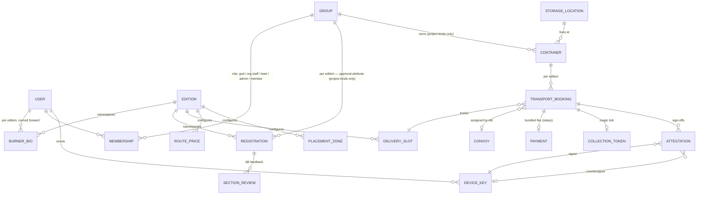

# MVP Proposal — Kickoff Demo Build

*Goal: a working, clickable raw MVP for the kickoff meeting, so the group tinkers with
something real instead of debating hypotheticals. Companions:
[`synthesis.md`](synthesis.md) (correlated requirements, incl. the two-vision
reconciliation) and [`roadmap.md`](roadmap.md) (release sequence beyond this MVP).*

## What the MVP is (and isn't)

**It is** a deployed web app with realistic seed data demonstrating the Layer-A (camp ⇄
AfrikaBurn) V1 golden paths end-to-end, the AB-staff side of each, **and the offline QR
attestation handshake live between two devices** — the answer to the room's inevitable
"but there's no signal at the Burn" question. **It isn't** production software: no real
payments, no real emails, no data migration, no full offline hardening. Every mocked
seam sits behind an interface a real implementation slots into later.

The camp-internal topics from the Quagga doc (onboarding, camper list, shifts,
budgets…) appear as stub pages labelled as *topics under exploration* — visible, honest,
and uncommitted. **Product stance throughout: the enemy is unfilled forms.** Every
screen must ask for less than the thing it replaces — prefill, derive, carry forward —
and the demo narrative should say so out loud.

### Demo walkthrough (the script for the meeting)

1. **Fresh participant sign-up** — new account → **Burner Bio onboarding** (short, self-serve, privacy-flagged fields, Camp 404 questionnaire pattern) → land as a plain burner. Browse the **group directory** (registered camps are public, each badged *accepting new members* or *invite-only*), then create a camp on the spot: it exists immediately as a **free camp** — members can join via invite link, internal features work, no AB involvement.
2. **Switch to a seeded registered camp** (e.g. *Mad Hatters*, lead account) — same camp concept but with the per-edition **registered/approved attribute**, which is what unlocks the entitlement tiles: registration status, containers, and greyed-out cards for Water / Ice / Gas ("V2 — pending AfrikaBurn input"), placement & art grants ("entitlement — process TBC with AB"), plus topic cards (Shifts · Budget · Layout — "topics under exploration"). The free-camp-vs-registered contrast *is* the product story: anyone can organise; registration earns entitlements.
3. **Registration wizard** — the six real sections from the 2026 Google Form, any order, save-and-return, 60-word counter, layout upload. Submit → status changes.
4. **AB staff view** — registrations dashboard, filters; open a camp, section-by-section review, request changes on one section; camp resubmits; approve.
5. **Container booking** — registry (codes, sizes, good standing, storage), booking wizard → photos → post-event storage → priority → capacity-aware slot picker → collection person → bundled price breakdown → **payment step: mock checkout / "pay by EFT with reference" + coordinator mark-as-paid** (provider decision deferred — the platform never holds funds) → booked.
6. **AB container coordinator** — slot/convoy config, bookings by day/slot, convoy assignment, printable manifest.
7. **Delivery day — the offline moment.** Two phones, wifi off. Driver's device shows a QR for "JAV-1 delivered to ERF GOW"; collection person scans, verifies, countersigns — both hold cryptographic proof, zero network. Reconnect one device → attestation syncs → the coordinator dashboard flips the booking to *Delivered*. This is the "no signal at the Burn" answer, live.

Everything except step 7's mechanism comes straight from the V1 scope documents; step 7
implements Ryan's offline directive.

### Explicitly out of the MVP

- Real payment processing — the MVP does payment-*status* tracking behind a `PaymentProvider` seam (mock checkout + EFT-reference + mark-as-paid). Gateway choice is deferred to AB discovery; requirement if integrated: SA-based, accepts international Visa/Mastercard (candidates: Paystack, Peach Payments, PayFast)
- Real email (dev inbox in MVP; Resend later)
- Full offline/PWA hardening — the attestation flow works offline-on-the-spot in the demo, but service-worker app-shell caching, pack-for-site sync, and recovery flows are R2
- Water/Ice/Gas beyond stubs (R3 — needs AB discovery input)
- Everything on the candidate/topic track: camp-people tools, budgets, layout designer, villages, compliance, artworks/MVs (see [`roadmap.md`](roadmap.md))
- Registration data migration, Capacitor mobile builds, WhatsApp/SMS

## Offline & attestation architecture (built in from day one)

**Operating assumption (Ryan's directive): on-site = no connectivity, ever.** Two modes:

- **Pre-event (online):** normal web app, desktop or phone.
- **On-site (offline):** the app serves reads from pre-synced local data, and writes are either queued or — where proof of a two-party interaction matters — **attestations**.

**The attestation primitive:**

1. **Device enrolment.** At login the device generates a keypair (WebCrypto ECDSA P-256, private key non-extractable, in IndexedDB). Public key registers server-side against the user or token identity. Lightweight roles (collection person, driver) enrol via their magic link.
2. **Handshake.** Party A renders a QR of a compact signed payload: `{type, subject ids, edition, nonce, keyId, sig}`. Party B scans (BarcodeDetector API, jsQR fallback), verifies A's signature against the **pre-synced public key set**, countersigns the whole thing, stores it locally; optionally displays a receipt QR back so both devices hold the double-signed record.
3. **Lazy sync.** Whenever any holding device gets connectivity, queued attestations upload. The server verifies both signatures and *derives* state (booking → Delivered) from the attestation log — append-only evidence, idempotent, order-tolerant, safe to sync from either party first.
4. **Honest limits.** Offline timestamps are claims, not proofs; nonces prevent replay; the signatures prove that these two parties interacted about this subject. Key loss = re-enrolment + revocation (R2).

MVP builds: `device_keys` + `attestations` tables, the sign/scan/verify/countersign
components, the sync endpoint, and delivery sign-off as the first attestation type. The
same primitive later serves ice redemption and gas handover (R3), and any candidate
topic with an on-site proof need ([`roadmap.md`](roadmap.md)).
Camp 404 shares this problem space — patterns should flow between the two projects.

**Design rules the offline constraint imposes everywhere:** on-site screens must work
from local data (no server round-trip in the critical path); on-site flows stay tiny
(single screen, single action); printable fallbacks for anything mission-critical.

## Stack

Base: **Camp 404** (`ryry79261/camp-404`) — same Vercel-centred tooling, minus what
doesn't apply, plus the attestation toolkit.

| Layer | Choice | Notes vs Camp 404 |
|---|---|---|
| Monorepo | Turborepo + pnpm workspaces, Node ≥ 22 | Same |
| Web | Next.js 16 (App Router), React 19, Tailwind v4, shadcn/ui | Same |
| DB | Neon Postgres + Drizzle ORM | Same patterns: schema.ts source of truth, append-only generated migrations, HTTP driver for handlers / pooled for jobs |
| Auth | Neon Auth (Better Auth) — email + Google OAuth | Same; plus magic-link/PIN token identities for handover roles; MFA for privileged roles later (R1) |
| Offline crypto | WebCrypto (ECDSA P-256), qrcode render, BarcodeDetector/jsQR scan | New — no external service; all client-side by design |
| Async tasks | Plain route handlers in MVP; **Inngest optional, added when a real async need lands (~R1: reminders, webhook processing, notification fan-out)** | Nice-to-have, not a spine dependency; would dodge the Vercel daily-cron cap |
| Payments | Status tracking behind a `PaymentProvider` seam (mock checkout + EFT reference + mark-as-paid) | **Never holds funds.** Gateway TBD with AB — must be SA-based and accept international Visa/Mastercard; candidates: Paystack, Peach Payments, PayFast |
| Storage | Vercel Blob | Container photos, layout uploads |
| Email | Dev inbox in MVP; Resend at R1 | |
| Hosting | Vercel | Same |
| Mobile | Responsive web; PWA at R2 | Capacitor not planned |
| Not carried over | FCM push, Telegram, AI providers, Groq | No current requirement (AI reappears ~Quagga Phase 3) |

Conventions adopted wholesale from Camp 404: workspace layout
(`packages/{ui,db,types,…}`), Zod at boundaries, bespoke-over-generic schema stance,
derived-not-stored roles, pgcrypto for sensitive columns (POPIA), `turbo run lint
typecheck test build` as the CI gate.

## Data model sketch

Key decisions encoded:

- **Participants are the base user.** Every account onboards a **Burner Bio** — a per-edition, privacy-flagged, self-serve profile (Camp 404 `burner_profiles` pattern) that carries forward year to year via confirm-and-copy. Camp affiliation is just a membership; participants without one are free campers with full accounts and no organisational features.
- **Editions (years) are the root namespace.** Bios, registrations, bookings all hang off the active edition; `editions` also own yearly config (zones, slots in 6m units, route/storage pricing).
- **Approval is an attribute, not existence.** Projects are self-registered by participants and work immediately (free camp). The per-edition registration record (7-state workflow) *is* the approval attribute; entitlements — placement application, art grants, container booking, water/ice/gas — derive from it. No pre-created camps, no AB gate on existence.
- **Questionnaire spine ported from Camp 404**: `questionnaire_definitions` + `questionnaire_responses` + `activations` + `required_actions` run the Burner Bio and any future gated flow (registration sections stay bespoke typed columns per the Camp 404 stance).
- **Requests = questionnaires, fulfilment = attestations**: camp requests (water sign-up, supplier services, extra allocations) are questionnaire-built forms whose submissions land in a **queue** owned by an org coordinator or a specific supplier; on-site fulfilment closes with a QR attestation. Schema: a thin `requests` table (questionnaire response ref, assignee: org role or supplier, status) — the R3 workflows and the supplier portal all ride this one pattern.
- **`groups`, not `camps`** — one joinable-group table, `kind ∈ {org, theme_camp, artwork, mutant_vehicle}`; a **project** = any non-org group (the kind that registers and earns entitlements). Exactly one seeded org group (AfrikaBurn). Memberships are many-to-many with roles — a burner can be in the org *and* multiple projects (Facebook-groups semantics, UI context switcher). Persistent `groups` and `containers`; per-edition everything else.
- **Directory, visibility & joinability** — registered groups are public/indexable in a **group directory** showing an *accepting new members* vs *invite-only* badge (`groups.joinability`; invites = Camp 404 one-time links). Visibility is currently *derived*: registered ⇒ public, unregistered ⇒ members-only — but a `groups.visibility` column is reserved now so real privacy settings can land later without migrations.
- **Wrangler assignments** — `wrangler_assignments` (org member × project × edition); powers a wrangler board reading per-camp progress (registration status, booking status; real milestones later).
- **Suppliers (schema reserved now, UI at R1)** — `suppliers` (business entity: services, contacts, vetting status, optional link to a burner account by email), `supplier_declarations` (registration × supplier — replaces the free-text suppliers field), `supplier_feedback` (org-visible). Supplier self-registration lives at its own URL (future `apps/suppliers` in the monorepo); the deep AB onboarding workflow (meetings, deposits) is a separate sub-project.
- **Admin tiers via memberships, not flags** — god admin (system-wide; bootstrapped for the first user via a `GOD_EMAILS`-style env, Camp 404 pattern) → org roles (coordinator/reviewer/wrangler) → group lead/admin → member. Replaces the earlier `is_staff` flag idea.
- **Registration sections are typed columns**; `section_reviews` per-section AB feedback with open/resolved state. Finlay's field list (mapped from the real form) is the whole schema — Graham's richer submission (camper lists, budgets, safety docs) is deliberately *not* modelled unless AB demonstrates a need.
- **Attestations are append-only evidence**; booking status (the 12-state lifecycle enum) is updated *from* verified attestations plus coordinator actions, with an audit-trail table for all transitions.
- **Roles derived, not stored**: everything flows from membership rows (org or project) plus the god bootstrap; tokens (not users) for collection persons/drivers.
- **pgcrypto + per-field privacy flags** on sensitive Burner Bio and contact columns now (POPIA); the heavier apparatus (masked IDs, audit logs, retention) only if identity-grade data is ever justified.

## Build plan (fan-out phases)

Phase 0 sequential; the lanes then parallelise with worktree isolation. Agent policy:
**Opus 4.8 / Sonnet 5 subagents; Fable only if absolutely necessary.**

| Phase | Work | Depends on |
|---|---|---|
| **0 — Scaffold** | Monorepo skeleton adapted from Camp 404 (strip Telegram/FCM/AI/Capacitor; **keep and port the questionnaire spine**), Neon + Drizzle + Auth wired, CI gate green, deployed to Vercel | — |
| **0b — Participant spine** | Burner Bio onboarding (questionnaire pattern, privacy-flagged fields), self-serve camp creation, **group directory with accepting-members/invite-only badge + one-time invite links**, free-camp vs registered attribute on the dashboard | 0 |
| **1a — Registration (camp side)** | Six-section wizard, draft/save/return, submission, status view, feedback loop — flips the approval attribute and lights up entitlement tiles | 0b |
| **1b — Registration (AB side)** | Staff dashboard, filters, section reviews, approve/request-changes/reject, notification events to the dev inbox | 0 (merges with 1a) |
| **2a — Containers (camp side)** | Registry, booking wizard, slot picker, photos, payment step (mock checkout / EFT reference), bundled pricing | 0b; entitlement-gated on 1a's approval attribute |
| **2b — Containers (AB/ops side)** | Edition config, coordinator dashboard, manifests (printable), 12-state lifecycle, collection-person magic-link flow, driver view | 0 (merges with 2a) |
| **2c — Attestation primitive** | Device-key enrolment, sign/QR-render, scan/verify/countersign, local store + sync endpoint, delivery sign-off wired into 2b's lifecycle | 0; integrates with 2b |
| **3 — Demo dressing** | Seed data (~15 camps incl. *Mad Hatters* & *Javaburn*, containers MAH-1/JAV-1 etc., 2027 edition config, obviously-placeholder prices), roadmap stub pages, polish, demo dry run incl. two-device attestation rehearsal | all |

Seed flavour deliberately uses the scope docs' own examples — the authors should
recognise their own data in the demo.

## Risks / decisions to keep in view

1. **Placement dependency** — container booking needs ERFs; MVP lets staff hand-assign ERF + code on the profile.
2. **Pricing unknowns** — seed obviously-placeholder numbers, labelled as such, so the meeting corrects rather than trusts them.
3. **Attestation demo risk** — camera/QR scanning across two physical phones must be rehearsed (lighting, screen brightness, browser camera permissions). Fallback: two browser windows side-by-side with a file-based "scan".
4. **Scope gravity from the Quagga doc** — its sixteen "Phase 1 modules" will pull the meeting toward "build everything". Counterweights: it's formally reframed as a topic map ([`synthesis.md`](synthesis.md)), the stub cards make every topic *visible* while only two workflows are *real*, and the fewer-forms principle gives a neutral, principled test to decline features with in the room (rather than arguing feasibility person-by-person).
5. **Money stance** — the platform never holds funds and camp dues/treasuries are permanently out of scope; the only money is AB-side logistics fees, and even those start as status tracking. Keep the demo narrative on this line so the meeting doesn't drift into treasury features.
6. **Licensing** — Camp 404 is FSL-1.1-ALv2; fine as a pattern source for a volunteer AfrikaBurn tool by the same author, but clarify intent early if this ever commercialises.

## Immediate next steps

1. ~~Process source docs into a correlated structure~~ → [`synthesis.md`](synthesis.md)
2. ~~Integrate the Quagga Portal vision + offline/attestation directive~~ → synthesis, this doc, [`roadmap.md`](roadmap.md)
3. **Add the sign-on HTML prototype to the repo** (still missing) so it can be reviewed and folded into the auth screens.
4. Approve/adjust this proposal → fan out on Phase 0.
