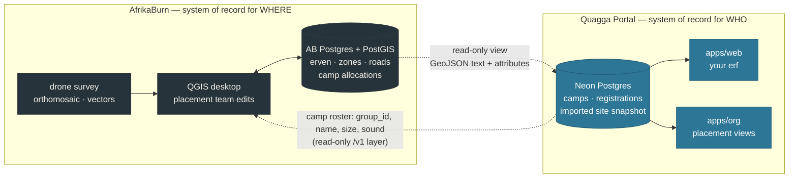

# QGIS site map — integration investigation

| Field                  | Value                                                                                                    |
| ---------------------- | -------------------------------------------------------------------------------------------------------- |
| **Category**           | Planning                                                                                                 |
| **Doc status**         | Draft                                                                                                    |
| **Normative language** | Descriptive only — this document reports findings and options; it does not itself impose requirements    |
| **Requirement IDs**    | Partial — `LAYOUT-*`, `ERF-*`, `REG-029`, `REG-030`. Best-effort, not audited; nothing here is built yet |
| **Owner / Updated**    | Repo maintainers, 2026-09-09                                                                             |

AfrikaBurn is building a QGIS site map for placement, from **drone survey work
and other sources**, and intends to **host it on a Postgres database** that this
platform would read **site vectors and theme-camp allocations** from.

This document works out what that means here: what changes on our side, what
contract we should ask them for while their schema is still being designed, and
what is left to decide.

**The short version.** This unblocks the named blocker. `roadmap.md`'s blocker
table lists _"Site map / erf data format — Placement candidate work — AB"_, and
[`technical-spec.md`](technical-spec.md) §11/§13 park the layout tool and erf
placement as ⚠️ **blocked, and not on code** — _"A scaled tool needs to know
real dimensions… That data does not exist in any structured form; the official
map is a PDF."_ Drone photogrammetry in a Postgres/PostGIS database is exactly
the structured, scaled data whose absence was the blocker.

**Three things follow, and one of them is urgent.**

1. **The urgent one is the join key.** Their allocation rows have to name our
   camps, and they are designing that schema now. A camp _name_ will not do the
   job — this codebase already runs trigram similarity checks on camp names
   because they collide. Ask them for a `quagga_group_id uuid` column while it
   costs nothing (§4).
2. **We should read a view they publish, not their tables** — one that emits
   geometry as GeoJSON text and is keyed to the edition, with a flag saying a
   row is finished. That contract keeps QGIS's editing freedom on their side of
   the line, and keeps PostGIS out of our database entirely (§3, §5).
3. **Authority splits cleanly, and should be written down before code:** their
   database is the system of record for **where**; ours stays the system of
   record for **who and whether** (§6).

---

## 1. What we now know, and what it settled

An earlier revision of this document opened with a question — was AfrikaBurn
building a GIS dataset of the site, or adopting QGIS's _Print Layout_ feature to
produce the yearly map PDF more reliably? That is settled: it is the dataset.
Recorded here because it is worth knowing the question was asked, and because
print layouts may well _also_ be in play. If they are, that is a separate,
welcome thing that changes nothing for us.

Two of the three questions that gated everything are now answered:

| Question                                    | Answer                                   | Consequence                                                                                                                                    |
| ------------------------------------------- | ---------------------------------------- | ---------------------------------------------------------------------------------------------------------------------------------------------- |
| Is the map georeferenced and to scale?      | **Yes** — drone survey and other sources | §11's objection ("a scaled tool… needs real dimensions") is answered on the site geometry. Stage 4 in §7 stops being hypothetical.             |
| What can they hand us, and how often?       | **A Postgres database**, read directly   | Better than any file hand-off, and it changes the integration shape: a live source of truth, with all the coupling questions that brings (§5). |
| Are erf identifiers stable across editions? | **Still open**                           | Question 3 in §8. The yearly re-layout means this decides how we key everything downstream.                                                    |

**One accuracy nuance worth stating so nobody over- or under-claims.** Drone
photogrammetry gives excellent _relative_ accuracy (centimetres between two
points in the same survey) but its _absolute_ accuracy depends on whether ground
control points or RTK positioning were used — without them, the whole model can
sit metres off its true position on Earth while being internally perfect.

For placement, relative accuracy is the one that matters: "does this camp's
frontage fit this erf" is a question about distances inside one survey, and the
drone data answers it well. Absolute accuracy only starts to matter if the same
coordinates get compared against phone or handheld GPS on site — wayfinding,
rangers, a "find my camp" feature. Worth asking (question 2 in §8), and worth
recording in whatever we import, so a later feature does not silently assume a
precision that was never there.

## 2. Their Postgres, our Postgres — the shape



Both arrows are one-directional, and that is the point. They never write to our
database; we never write to theirs. Each side owns what it is authoritative for
(§6), and the two arrows are separate contracts that can ship independently —
the outbound one (bottom) needs no geometry at all and is useful the moment it
exists.

## 3. What to ask them for: a published view, not their tables

**Do not read the tables QGIS edits.** Ask for a **read-only view** (or a set of
them) that AfrikaBurn maintains as a deliberate contract. This is the single
highest-leverage thing to agree while their schema is still fluid, for four
reasons:

1. **QGIS reshapes tables.** Adding a field in the layer properties, changing a
   type, renaming — all normal editing operations, all breaking changes to a
   consumer reading the table directly. A view absorbs that.
2. **A live editing database contains work in progress.** Half-drawn polygons,
   a draft re-layout, an allocation someone is still thinking about. A view that
   filters on a `status`/`published` flag is what stops the portal from showing
   a camp an erf that nobody has agreed to yet.
3. **It keeps PostGIS out of our database.** If the view emits
   `ST_AsGeoJSON(geom)` as text, we receive strings. No geometry column type, no
   `CREATE EXTENSION`, no Drizzle `customType` (§5).
4. **It keeps the interesting maths on the side that has PostGIS.** Area, road
   frontage length, bounding box, centroid — all one function call for them, all
   fiddly for us. Ask for them as **precomputed attribute columns**.

A concrete sketch to hand them, as a starting point to argue with rather than a
specification:

```sql
-- Site geometry, one row per erf, per edition.
CREATE VIEW quagga_erven AS
SELECT
  e.erf_code                              AS erf_code,      -- stable within an edition
  e.edition_year                          AS edition_year,  -- the layout changes yearly
  ST_AsGeoJSON(ST_Transform(e.geom, 4326)) AS geom_geojson,  -- WGS84, per the GeoJSON spec
  ST_Area(e.geom)                         AS area_m2,       -- computed in the projected CRS
  e.road_frontage_m                       AS road_frontage_m,
  e.zone_name                             AS zone_name,
  e.sound_band                            AS sound_band,
  e.published_at                          AS published_at   -- NULL = not ours to show
FROM erven e
WHERE e.published_at IS NOT NULL;

-- Allocations: which camp sits on which erf. See §4 on quagga_group_id.
CREATE VIEW quagga_allocations AS
SELECT
  a.erf_code,
  a.edition_year,
  a.quagga_group_id,        -- OUR groups.id, the join key that makes this work
  a.camp_name_snapshot,     -- for their own eyeballs; we never join on it
  a.status,                 -- proposed | confirmed — we only surface confirmed
  a.updated_at
FROM allocations a;
```

Three notes on the sketch:

- **`ST_Transform(…, 4326)`** matters because GeoJSON is defined in WGS84, while
  measurements must happen in a projected CRS — which is why `area_m2` is
  computed on the untransformed geometry. Getting this backwards produces areas
  in square degrees, a classic and quiet error.
- **`updated_at`** is what makes a cheap incremental import possible.
- **`status`** is what lets a wrangler work in QGIS without every intermediate
  thought reaching a camp.

## 4. The join key — the one thing to ask for this week

Their allocation table needs to identify our camps. This is cheap to get right
now and expensive to retrofit, because it is a column in a schema they are
designing today.

**Ask for `quagga_group_id uuid`**, holding this platform's `groups.id`.

**Why not the camp name.** This codebase already treats camp names as unreliable
identifiers, and has the machinery to prove it: `/camps/new` rejects an exact
normalised collision and _warns_ on trigram similarity ≥ 0.55
(`apps/web/lib/groups-store.ts:767`), because near-duplicate camp names are
normal, not exceptional. Camps also rename between years. A join on name will
work in testing and mismatch in production, on the rows that matter most.

**Why not the slug either.** `groups.name_normalized` is unique per kind and the
slug derives from the name — both are stable in practice but neither is
guaranteed across a rename. `groups.id` is a UUID that never changes.

**What we owe them in exchange:** a camp roster they can pull into QGIS — id,
name, edition, size, sound level, placement preferences. That is the outbound
arrow in §2, and §9 covers how it reaches them.

**A fallback worth mentioning, not preferring.** Roadmap R1 already plans
_"staff-assigned ERFs + camp codes on profiles"_. If a camp code lands first and
is genuinely stable, it can carry the join instead. But it is a value someone
assigns, and the UUID is a value nobody has to remember to keep unique.

## 5. Reading their database: the mechanics, and the honest cost

Four things need deciding, and none of them are hard as long as they are decided
rather than discovered.

### 5.1 The driver — a second one is needed

`@quagga/db` is built on `@neondatabase/serverless`, which speaks two
Neon-specific protocols: SQL-over-HTTP for the stateless driver and WebSocket
for the pooled one. It cannot talk to a plain Postgres directly — that is
exactly why `packages/db/src/local-proxy.ts` exists, pointing both protocols at
local proxies so the stack can run against a Docker Postgres.

So an external read needs `pg` or `postgres.js`, on the `nodejs` runtime, in
code that must never be imported by anything the browser bundles. The clean
place is a separate export path, following the precedent already set by
`@quagga/core/report-server` — a separate entry point precisely so its
server-only dependencies stay out of every browser bundle
([`architecture.md`](architecture.md)).

### 5.2 Snapshot import, not a live read on the request path

**Recommendation: import into our Neon on a schedule and on demand, and serve
every page from our own database.** Three reasons, in descending order of how
much they matter:

- **The boot law.** All three apps MUST boot and serve without any external
  service ([`AGENTS.md`](../AGENTS.md) rule 4). A page that queries AfrikaBurn's
  Postgres on render makes their uptime our uptime.
- **Editing in progress.** §3's `published_at` filter helps, but a snapshot adds
  a second gate: someone on our side sees what changed before camps do.
- **Serverless connection pooling.** Every function instance opening a
  connection to a Postgres that is probably not behind PgBouncer is how you
  exhaust `max_connections` on someone else's database during a traffic spike.
  An importer opens one connection, on a schedule.

The import is a small job: read the two views, upsert into our tables (or write
one snapshot row per edition), record what came from where and when. The org
console gets a "refresh site data" button and a "last imported" line — the
`/system` panel pattern already reports resolved state without printing values.

**When a live read is defensible:** a staff-only placement view in `apps/org`
where staleness is the actual complaint. Even then, cache it, and make the page
render with a "couldn't reach the map database" state rather than an error.

### 5.3 Connectivity — check this early, it can be a hard blocker

Where their Postgres lives determines whether we can reach it at all:

- **A managed provider with a public TLS endpoint** (Neon, RDS, Cloud SQL,
  Supabase, a VPS) — straightforward.
- **IP allowlisting**, which is what a sensible DBA will want, needs a stable
  outbound address. Vercel functions use dynamic outbound IPs by default; static
  IPs are available on Pro and Enterprise plans, which is a plan-level cost
  question, not an engineering one.
- **On-premises, or inside a VPC with no public endpoint** — then a direct read
  is out, and the answer is either a push (they export to us) or a small relay
  they host.

Worth asking before anyone writes an importer, because the answer can invalidate
§5.1 and §5.2 entirely.

### 5.4 Geometry storage on our side — still no PostGIS

The previous revision of this document weighed PostGIS in our Neon database. The
view contract in §3 mostly dissolves the question: if geometry arrives as
GeoJSON text with measurements precomputed, we store **GeoJSON in `jsonb`** —
which the schema already uses widely — and any geometry maths we still need
(point-in-polygon, rectangle overlap, clearance rings) goes in `@quagga/core` as
pure functions.

That is not just convenience, it matches how this codebase has twice decided the
same question:

- `pgcrypto` — the schema says "pgcrypto-encrypted", but
  `packages/db/src/crypto.ts:12-13` states plainly that Node's AES-256-GCM is
  used instead, _"same threat model."_
- `pg_trgm` — the camp-name dedupe above computes trigram similarity as a pure
  function in `@quagga/core`, over rows fetched with a plain `select`.

This database carries **zero Postgres extensions**, twice on purpose. Hundreds of
erven is nowhere near the scale at which spatial indexes and `ST_*` queries earn
their keep, and PostGIS now lives on the side of the wire that genuinely needs
it. Verified for the record in case that changes: Neon does support `postgis`
(plus `postgis_raster`, `pgrouting`, `h3_postgis`, SFCGAL); Drizzle's `geometry`
type predefines `point` only, so polygons would need a `customType`; and the
extension itself needs `drizzle-kit generate --custom` plus a privilege check on
the app's Neon role. None of that is required by the design above.

Also unchanged: the schema is **frozen** ([`build-spec.md`](build-spec.md) hard
constraint 5, and the "Schema (frozen)" heading). Any new table for imported
site data is a maintainer decision, and `.github/CODEOWNERS` puts migrations
behind review regardless. §7 stages 1 and 2 are deliberately arranged to need no
new table.

### 5.5 The drone imagery is not a Postgres problem

The vectors belong in Postgres. The orthomosaic does not: drone surveys produce
GeoTIFFs from hundreds of megabytes to gigabytes, and neither their database nor
our Blob store is the right place to serve one from.

For everything in §7, **vectors alone are enough** — erf outlines and zone
boundaries drawn on a plain background read perfectly well as inline SVG, with
no map library and nothing added to the bundle.

If imagery is genuinely wanted later, in rough order of cost: a **pre-rendered
image** at a fixed extent with a known bounding box (works with the same SVG
overlay, costs nothing, good enough for a site plan); **XYZ/COG tiles** they
publish once per edition, which brings in a map library and a tile-hosting
question; or `postgis_raster` in their database, which still needs a tile server
in front of it. Not for stages 1–3.

## 6. Authority — write this down before writing code

Allocations living in their database is a genuine change to who decides what, so
state it explicitly:

| Question                                    | System of record | Why                                                                                                         |
| ------------------------------------------- | ---------------- | ----------------------------------------------------------------------------------------------------------- |
| Where is this camp?                         | **AfrikaBurn's** | Placement is discretionary and theirs. It is decided in QGIS with the map in front of them.                 |
| Which camps exist, and are they registered? | **Ours**         | `isRegistered` — a camp is registered iff an approved registration row exists (`@quagga/core`).             |
| What did the camp ask for?                  | **Ours**         | `s5_placement_first_choice` / `_second_choice`, sound plan, neighbour requests.                             |
| Is the allocation shown to the camp?        | **Ours**         | Their `status`/`published_at` says a row is _finished_; whether the portal surfaces it is a product choice. |

Two consequences to decide, not discover:

- **An allocation for a camp with no approved registration.** Their database can
  legitimately hold one — placement thinking runs ahead of paperwork. Entitlements
  derive from `isRegistered`, so the portal should not turn an allocation into an
  entitlement on its own. Suggested rule: import it, show it to staff, do not
  show it to the camp until the registration is approved. Worth confirming with
  AfrikaBurn rather than assuming.
- **`REG-029`/`REG-030`** (the App Spec's placement-allocation states) become
  **derived**, not owned: the portal reflects a state that exists elsewhere. That
  is a smaller build than the spec implies, and worth noting in
  [`technical-spec.md`](technical-spec.md) §14 when this ships.

## 7. A staged path, each stage shippable alone

Deliberately ordered so no stage requires the next, and so the first two need no
schema change.

**Stage 0 — no code.** Agree §3's view contract and §4's join key while their
schema is fluid, and get read-only credentials against a copy or a staging
database. Answer §8's connectivity question. Nothing else is worth starting
first.

**Stage 1 — zones become real.** Import the zone layer per edition and replace
the hardcoded list in `packages/core/src/placement-zones.ts` — a file whose own
header says zones _"change year to year and must be configurable per edition"_
and that the frozen schema has no table for. Registration's `PlacementSelect`
(`apps/web/components/registration/field-kit.tsx:499`, fed from
`registration-wizard.tsx:152`) gains real options and a map to look at while
choosing. The `s5_placement_*` columns already store a zone's human-readable
name verbatim (`packages/db/src/schema.ts:1120-1121`), so **no migration**.

**Stage 2 — the erf index.** Import erf polygons with identifiers, dimensions
and frontage. This is what makes roadmap R1's _"staff-assigned ERFs + camp codes
on profiles"_ an object with a real footprint rather than a text field — and note
that R1 item was never blocked; this upgrades it. Unblocks container booking and
the water-supplier sign-up, both of which need a location and neither of which
needs a layout tool.

**Stage 3 — allocations, and "your erf".** Import `quagga_allocations`, join on
`groups.id`, and show a camp its erf: dimensions, road and public frontage,
neighbours. Then the propose → approve/reject/comment/revise loop
(`ERF-019`–`ERF-023`) on the `section_reviews` pattern, with the wrangler from
`wrangler_assignments` (`schema.ts:1190`) as the proposer. §13 already says this
is a reuse job rather than a new subsystem — and if the negotiation happens in
QGIS instead, this stage shrinks to a read-only view plus a comment thread.

**Stage 4 — the scaled canvas.** `LAYOUT-001`–`043` and `ERF-001`–`018`: the
object library (tents, containers, generators, water tanks, each with clearance
and safety areas) on a canvas scaled to the real erf. **Drone data is what makes
this legitimate**, and §1's accuracy note is the caveat to carry into it: render
what the data supports, and say what it does not. The overlap **warnings** are
worth shipping long before any automatic-arrangement optimiser (§12).

**One rule across all stages.** We never write geometry back. If proposed
allocations ever need to reach QGIS, they go as data AfrikaBurn imports or reads
— not a two-way sync. Two systems both authoritative over the same polygons is
the container-vs-Quicket mistake in a new costume.

## 8. Questions for AfrikaBurn

Ordered by how much they block. The first three are schema decisions being made
now.

1. **Will you add `quagga_group_id uuid` to the allocation table** (§4), and
   what would you like from us to populate it?
2. **What CRS?** Both halves matter: the storage CRS for measurement, and what
   the view emits. A South African drone survey plausibly arrives in
   **Hartebeesthoek94 / Lo19 (EPSG:2048)**, whose axes are **west- and
   south-positive** — a real source of silently mirrored geometry for anything
   that assumes east/north. UTM 34S (EPSG:32734) is the other likely candidate.
   Whatever it is, we would like the view to emit **EPSG:4326 GeoJSON** with
   measurements precomputed in the projected CRS (§3).
3. **Are erf identifiers stable within an edition? Across editions?** The layout
   changes yearly, so an "erf 42" that moves between years is a different place
   with the same name. This decides how we key everything downstream.
4. **Would you publish views rather than expose tables** (§3), and would you
   include a `status` or `published_at` so we never show a camp a work-in-progress
   allocation?
5. **Where will the database live, and how do we reach it?** Public TLS
   endpoint, IP allowlist, or inside a private network? This can be a hard
   blocker (§5.3), so it is worth answering before we build an importer.
6. **Can we have a read-only role**, scoped to those views, plus a staging or
   sample copy to develop against? Access to live placement data is not needed
   to build any of this.
7. **What attributes will each erf carry** — dimensions, road frontage, public
   frontage, zone, sound band, vehicle access, environmental restrictions?
   Anything you can compute on your side (§3) saves us doing it worse.
8. **Was ground control or RTK used in the survey** (§1)? Not a blocker for
   placement; it decides whether these coordinates can ever be used for
   on-site navigation.
9. **Would a live layer of registration data in QGIS be useful** (§9), and if
   so, which fields does the placement team actually need? Naming them is what
   keeps the endpoint minimal.
10. **Who owns the map data and what may be shown to whom?** Staff-only,
    registered camps seeing their own erf, or a public site map. We need this
    before anything renders in a browser.

## 9. The other direction: feeding their QGIS

Worth keeping on the table even though the inbound arrow is now the headline,
because it is the cheapest useful thing here and it does not wait on any of §7.

The placement team allocates camps to erven by weighing size, sound level,
interactivity, MOOP record and neighbour requests. Every one of those attributes
is already in this database — `registrations` §4 size and §5 sound/placement
columns, supplier declarations, the review history. Today it reaches a wrangler
as a spreadsheet (`roadmap.md` R1: _"export for placement"_).

A **read-only camp roster on `/v1`** would let their QGIS load it as a live
layer: QGIS opens vector layers straight from an HTTP(S) URL, and its
authentication manager has an **API Header** method that attaches an
`Authorization` header, so an integrator key works with no plugin. The
`docs/sdk/` design already provides the machinery — closed scope strings, a
server-issued capability manifest, zod output schemas as the PII stripper — so
this is a `placement` read scope and one response schema, not a new
architecture.

It is also what makes §4's join key easy for them: the same endpoint that feeds
their map hands them the UUIDs.

**The caution:** camp attributes leaving the platform into a desktop tool is a
POPIA surface. Keep the field list minimal and explicit in the response schema,
and never include the hard-locked or safety-visible fields
([`accounts-security-spec.md`](accounts-security-spec.md)). Erf allocation needs
camp name, size, sound level and preferences — not contacts, not identity
fields.

## 10. Risks

| #      | Risk                                                                                                                                                                 | Mitigation                                                                                                                 |
| ------ | -------------------------------------------------------------------------------------------------------------------------------------------------------------------- | -------------------------------------------------------------------------------------------------------------------------- |
| **1**  | **No usable join key.** Allocations we cannot reliably attach to a camp, matched on names that collide by nature.                                                    | §4, this week, while it is a column in an unfinished schema. Everything in stage 3 depends on it.                          |
| **2**  | **Reading a live editing database.** Half-drawn geometry, a draft re-layout, or an allocation someone is still thinking about, shown to a camp as fact.              | The `published_at`/`status` filter in §3, plus snapshot-and-review rather than live reads (§5.2).                          |
| **3**  | **Their schema changes under us.** Normal QGIS editing is a breaking change to a consumer reading tables directly.                                                   | The view contract (§3). Fail loudly on a shape change — validate at the boundary, as this repo does everywhere else.       |
| **4**  | **We cannot reach the database** (private network, or IP allowlisting we cannot satisfy).                                                                            | Ask now (§8 question 5). Fallback is a push export or a small relay they host.                                             |
| **5**  | **Live coupling breaks the boot law.** Their maintenance window becomes our broken page.                                                                             | Import snapshots; serve from our Neon (§5.2). Never a query on the request path for a camp-facing page.                    |
| **6**  | **CRS or axis-order error.** EPSG:2048's west/south-positive axes mirror geometry silently; measuring in EPSG:4326 yields square degrees.                            | Fix it in the view (§3), not in our code. Assert an expected SRID and a plausible bounding box on import, and fail loudly. |
| **7**  | **False precision at stage 4.** Drone relative accuracy is good; absolute may not be. A canvas that implies survey precision it does not have misleads camps.        | §1's distinction, carried into the UI. Record accuracy provenance on import; state it where it matters.                    |
| **8**  | **Yearly re-layout invalidating stored geometry.** The layout changes every year — which is why placement was deferred in the first place.                           | Key every imported row to the edition, exactly as `placement-zones.ts` already keys zones to a year. Never one global map. |
| **9**  | **Publishing camp locations.** An erf map showing who is where is a disclosure decision, not a rendering one.                                                        | §8 question 10 before anything renders. Default staff-only → own-erf → public.                                             |
| **10** | **Two systems both authoritative.** Allocations edited in both QGIS and the portal, disagreeing quietly.                                                             | §6's split, written down. One direction only; we never write geometry.                                                     |
| **11** | **Scope creep into a GIS.** §11 calls the object library _"largely a data-entry exercise"_; the canvas was the blocked part. Now unblocked, it is easy to overbuild. | Stages 1–3 deliver value with no canvas at all. Stage 4 is a separate decision with its own justification.                 |

## 11. Recommendation

1. **This week, with them:** §4's join key and §3's view contract. Both are
   nearly free while their schema is unfinished and expensive afterwards. Send
   §8's questions 1–4 as a single ask.
2. **Answer the connectivity question next** (§8 question 5) — it can invalidate
   the importer design before it is written.
3. **Build §9 in parallel**, whatever the answers. The outbound camp roster is
   small, one-directional, needs no geometry, and makes the portal useful to the
   placement team this season.
4. **Then stages 1–3 in order**, snapshot-imported, GeoJSON in `jsonb`, geometry
   maths as pure functions in `@quagga/core`. No PostGIS on our side, no new
   table before stage 2.
5. **Update `roadmap.md` and `technical-spec.md` §11/§13 when the view contract
   is agreed, not now.** The ⚠️ blocked status was always conditioned on _"until
   AB's map process changes"_ — and it is changing — but "AfrikaBurn is building
   a database" is not the same fact as "we can read it", and the docs should
   flip on the second one.
6. **Leave stage 4 as its own decision.** The data blocker is lifting; that
   makes a scaled layout tool possible, not automatically worth building.

---

### Sources for the external claims above

Every claim about this repository carries a file path inline. The external ones:

- QGIS Server OGC API Features (GeoJSON output, landed 3.10):
  [docs.qgis.org — OGC API Features](https://docs.qgis.org/3.40/en/docs/server_manual/services/ogcapif.html)
- QGIS authentication manager, API Header method:
  [docs.qgis.org — Authentication System Overview](https://docs.qgis.org/3.44/en/docs/user_manual/auth_system/auth_overview.html)
- Hartebeesthoek94 / Lo19 axis orientation (westing/southing):
  [epsg.io — EPSG:2048](https://epsg.io/2048)
- Vercel outbound IPs and static IPs by plan:
  [Vercel — Static IPs](https://vercel.com/docs/networking/static-ips),
  [changelog](https://vercel.com/changelog/static-ips-are-now-available-for-more-secure-connectivity)
- Neon PostGIS availability and related extensions:
  [Neon docs — the postgis extension](https://neon.com/docs/extensions/postgis),
  [PostGIS-related extensions](https://neon.com/docs/extensions/postgis-related-extensions)
- Drizzle `geometry` (point only) and the `--custom` migration for
  `CREATE EXTENSION postgis`:
  [Drizzle docs — PostgreSQL extensions](https://orm.drizzle.team/docs/extensions/pg),
  [PostGIS geometry point guide](https://orm.drizzle.team/docs/guides/postgis-geometry-point)
